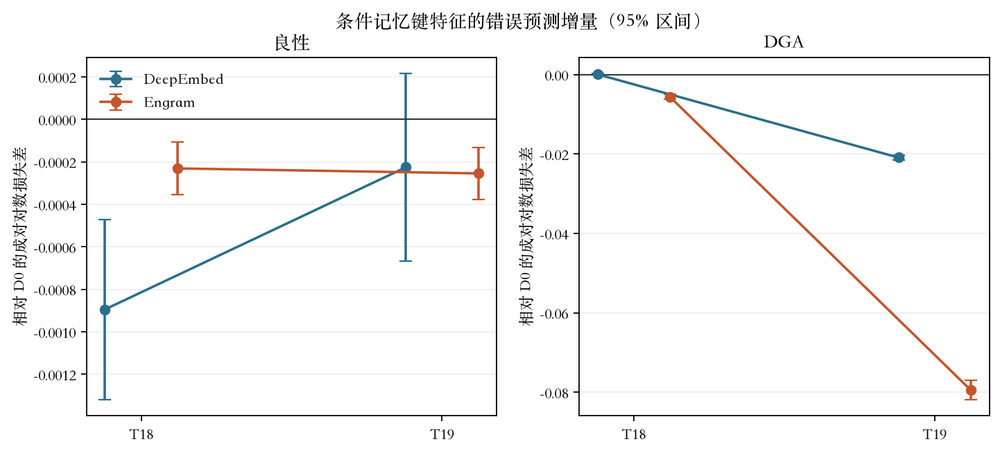
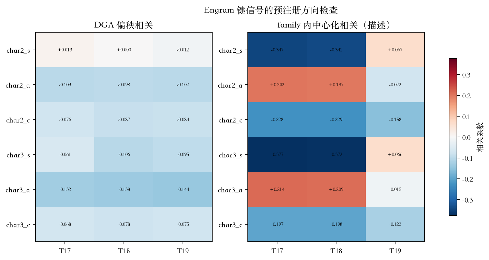

# DRIFT 条件记忆源期资格结果裁决

## 一、执行摘要

**R02 DeepEmbed 与 R07 Engram 的当前 DRIFT 任务化形式被源期资格门否决，不启动等容量短训。**

DeepEmbed 失败独立改善、真实键对两种负控、表内改善和已见 family 改善等多项门。Engram 在 T18/T19×良性/DGA 四个单元上都改善了对 C00 错误的预测对数损失，也同时超过两种打乱负控；但 DGA 中没有任何一个预注册信号在 T17/T18/T19 三年都呈正相关。这意味着真实键有诊断信息，但它不支持“低支持／组合惊异／语义碰撞越大，DGA 越易出错”这一已冻结任务化假设。

原始状态 `rejected_after_source_qualification` 成立。该结论只否决当前 DRIFT 任务化形式，不否决 DeepEmbed 或 Engram 在其他任务上的一般效果。

## 二、实验身份与决策语境

- 原始结果：[结果 JSON](../../../thesis/experiments/llm_probe/runs/diagnostics/ch3-drift-condmem-source-qualification-v1/result.json)。
- 结果 SHA-256：`fb7d95130a1c0432d12e98e678f2699a08e95b90cc93e50e96f99a16aeb10b92`。
- 研究卡：[第三章 DRIFT 条件记忆机制轴研究卡](../../../thesis/methods/第三章-DRIFT条件记忆机制轴研究卡.md)。
- 分析包：[严格分析](analysis-output/analysis-report.md)、[统计附录](analysis-output/stats-appendix.md)、[图件目录](analysis-output/figure-catalog.md)。
- 实验性质：`screening_only=true`；只诊断冻结 C00 错误，不训练 DeepEmbed 或 Engram。
- 决策问题：是否允许一次普通嵌入／等参数前馈网络／DeepEmbed／Engram 等容量短训。

## 三、设置与评价协议

- T17 `train` 只用于拟合字符一／二／三元与 WordPiece 一元文档频数，每类 1,500,000 个唯一 eSLD。
- T17 `val` 每类 150,000，只拟合一次分类别错误预测器和经验秩变换。
- T18/T19 `val` 每年每类 150,000，冻结前向，不重拟合词表、频数、系数或阈值。
- T20–T25 未被发现或读取。
- C00 为 T17-only 缩容双分支资格模型，检查点 SHA-256 `45abd755…`；它不是正式强 C00。
- 主统计单元是同一 eSLD 上两个错误预测器的成对对数损失差。

## 四、实现与错误修复史

### 4.1 最终实现身份

| 制品 | 路径 | SHA-256 |
| --- | --- | --- |
| 配置 | `thesis/experiments/llm_probe/configs/ch3-drift-condmem-source-qualification-v1.json` | `0280da3d3e5a0ba61141d9edbeda4e0c3af5a318845a9ad3e1298722efd263b8` |
| 实现 | `thesis/experiments/llm_probe/tools/ch3_drift_condmem_source_qualification.py` | `7e669b37ccca1b8052f15458d1f40036c9ff3ac8157f150b739c80c1b01e1f92` |
| 启动器 | `thesis/experiments/llm_probe/scripts/remote_launchers/run_ch3_drift_condmem_source_qualification_v1.sh` | `5ae3c7485b162b2173828c2bb0469f234493745607b01c4016c7274f2664f07b` |

### 4.2 运行前错误与处置

1. 首次启动发现服务器缺 T18/T19 四个 `val` 文件，在计算前以 `FileNotFoundError` 停止。随后只同步配置中已冻结 SHA-256 的四个文件，未改数据成员或研究问题。
2. 第二次启动发现 raw Parquet 实际列顺序为 `domain,label,family`，而入口断言期待 `domain,family,label`。只修正列顺序断言，不改数值计算、数据角色或判据。
3. 之后使用同一配置与运行身份 `--resume`，最终以上表哈希发布结果。

### 4.3 分析审计发现

主诊断、负控、表内、已见 family 对数损失和分类别正方向门均按研究卡执行。但 `family_centered_correlation()` 实际包含当年全部唯一 family，而研究卡要求仅 T17 已见 family。因此 family 中心化门降为描述性证据。Engram 另有完全独立的 DGA 正方向门失败，所以不需修复或重跑来裁决本轮。

## 五、主要发现

### 5.1 完整门表

| 门 | DeepEmbed | Engram |
| --- | --- | --- |
| 四个类别×年份单元独立改善 | 失败 | 通过 |
| 真实键同时优于两种负控 | 失败 | 通过 |
| 表内子集改善 | 失败 | 通过 |
| T17 已见 family 改善 | 失败 | 通过 |
| 良性与 DGA 各有三年一致正方向信号 | 通过 | **失败** |
| family 内中心化三年正向 | 有输出，但实现偏差 | 无，且实现偏差 |
| 总体 | **否决** | **否决** |

### 5.2 对 D0 的错误预测增量

| 类别 | 年份 | DeepEmbed 对数损失差（95% 区间） | Engram 对数损失差（95% 区间） |
| --- | --- | ---: | ---: |
| 良性 | T18 | `-0.0008942 [-0.0013181,-0.0004702]` | `-0.0002307 [-0.0003545,-0.0001070]` |
| 良性 | T19 | `-0.0002253 [-0.0006658,0.0002153]` | `-0.0002541 [-0.0003760,-0.0001322]` |
| DGA | T18 | `+0.0000702 [-0.0001084,0.0002488]` | `-0.0055605 [-0.0061541,-0.0049669]` |
| DGA | T19 | `-0.0208816 [-0.0214583,-0.0203049]` | `-0.0794162 [-0.0818069,-0.0770256]` |

### 5.3 Engram 为什么仍被否决

Engram 的 DGA 偏秩相关中，除 `char2_s` 在 T19 变为负值外，其他多个信号虽跨年稳定，却稳定为负：

- `char2_a=-0.10256/-0.09826/-0.10174`。
- `char2_c=-0.07604/-0.08712/-0.08409`。
- `char3_s=-0.06085/-0.10581/-0.09538`。
- `char3_a=-0.13189/-0.13809/-0.14406`。
- `char3_c=-0.06770/-0.07766/-0.07459`。

研究卡预注册的是正方向，即支持负担、组合惊异或语义碰撞越大，C00 损失越大。当前 DGA 读数不支持这一机制语义。不能因错误预测对数损失有利，就在看数后把负相关重新命名为新正向。

## 六、统计验证

- 成对区间基于固定 eSLD 预测，样本量每格 150,000。
- 未作多重比较校正；裁决采用所有预注册门必须同时通过的合取规则，不从多个区间中选有利项宣称成功。
- 偏秩相关无区间，只能用于预注册符号检查，不可称“显著相关”。
- family 不等于 generator；当前 family 中心化还有成员范围偏差。
- 本实验没有训练候选模型，不能把诊断预测改善写成分类效果。

## 七、图件解读

- 图 1 用于分离“错误预测信息”和“机制训练收益”。读者应注意 Engram 四格都低于 0，但它仅表示键特征能预测 C00 错误。
- 图 2 用于检查预注册方向。DGA 中的稳定负值和 family 相关符号变化使“低支持驱动条件记忆”的现有解释无法成立。

## 八、失败案例与限制

- DeepEmbed 有局部有利格，但无法同时通过良性、DGA、T18、T19 和负控门。
- Engram 对错误有更强预测力，但它的方向不支持当前机制假设。
- C00 只是缩容单种子资格模型。该否决不能直接外推到官方满容量 DRIFT。
- `features-T19.parquet.partial` 是非权威残留；结果只引用有收据哈希的 `features-T19.parquet`。

## 九、认知变化

实验前，我们认为表内低支持和组合惊异可能是条件记忆的直接病灶。实验后，证据改为：**二／三元真实键含有错误结构，但该结构在 DGA 中不遵循已设定的低支持正向解释。** 因而应停止为当前条件记忆付费短训，转而检验是否由 family 组成与辅助任务反馈导致。

## 十、允许与禁止主张

### 允许

- “R02/R07 当前 DRIFT 任务化形式未通过 T17–T19 源期资格门。”
- “字符二／三元真实键含有超过两种打乱负控的 C00 错误预测信息。”
- “该信号在 DGA 中与预注册的正方向假设不一致。”

### 禁止

- “Engram 或 DeepEmbed 在 DRIFT 上一般无效。”
- “Engram 已提高 DGA 检测性能。”
- “当前数据证明低支持是未来年 DGA 退化原因。”
- “family 分面等于 generator 泛化。”
- 任何 T20–T25 效果主张。

## 十一、后续假设边界

### 11.1 当前证据到底说明了什么

当前只证明：**由 T17 冻结的高阶安全键统计能在 T18/T19 增加对 C00 错误的预测信息。** 它没有证明下列任何一项：

- Engram 记忆向量可以纠正 C00 分类。
- 把键嵌入加到骨干会改善低误报或 DGA 检出。
- 表内低支持、组合惊异或语义碰撞越大时必然越容易出错。
- 二／三元键预测到的是可跨 generator 复用的因果病灶。

因此，原“低支持驱动的静态条件记忆”假设保持否决，不能换名后继续短训。

### 11.2 待立新卡：键条件可靠性路由／有符号条件记忆

可登记一个与旧 R07 不同的待证假设：

> 高阶安全键不直接存储类别答案，而是估计当前骨干在该局部结构上的可靠性；可靠性路由器在基线路径与专门分支之间选择，或用有符号门对记忆贡献进行增强、抑制或置零。它不再假定低支持的影响方向在良性与 DGA 中恒为正。

该方向的可能任务化差量只能是“安全键可靠性估计＋可增可抑的有符号路由＋伪未来 family 源侧反馈”的整体。family 和年份只能在源期训练时构造伪未来分组或特权反馈，不得进入推理键、路由器输入或阈值。

### 11.3 必须超过的直接近邻

新卡若获得实现资格，至少同时比较：

1. **普通错误预测器**：相同键统计只预测 C00 可靠性，不回写分类器，检验路由是否真有增量。
2. **静态 Engram**：相同键和容量的非负门记忆残差，检验收益是否来自有符号抑制而非普通查表。
3. **参数匹配 MoE／可学门**：不读高阶键的等参数专家或门控，检验是否只是额外分支容量。
4. **打乱键**：保留频数、分支、参数和训练预算，破坏真实键与可靠性的对应。

若收益被普通错误预测、静态 Engram、等参数 MoE／门或打乱键中任一直接近邻解释，就不得宣称新主方法。

### 11.4 禁止同一 T18/T19 事后自证

T18/T19 `val` 已用于发现“真实键预测有效但 DGA 方向相反”。它们现在是**假设生成数据**，不得再作新有符号路由假设的独立确证集。

新研究卡必须在任何新成员开启前，冻结公式、伪未来 family 分组、直接近邻、评价向量和止损门。确证只能来自本轮未用过的源期成员，或另一个事前冻结的安全数据面；不得重用 T18/T19 `val` 区间宣称假设被证实。未冻结新数据角色前，本方向只标“待立研究卡”，不批准实现。

## 十二、下一动作

1. 停止 R02/R07 当前形式，不启动等容量短训。
2. 不恢复 M1-v1/v2、M2/J06 或 ROSA，不为 `2×2` 机械寻找第二机制。
3. 下一研究卡应并列比较两个由源期结果产生的假设：“伪未来 family 反馈的辅助任务课程”与“键条件可靠性路由／有符号条件记忆”。二者都是待立卡假设，不预设哪个是第二机制，也不允许用已观测的 T18/T19 `val` 事后自证。

## 十三、制品与可复核索引

- [严格分析报告](analysis-output/analysis-report.md)
- [统计附录](analysis-output/stats-appendix.md)
- [图件目录](analysis-output/figure-catalog.md)
- [图 1 PDF](analysis-output/figures/figure-01-logloss-difference.pdf)
- [图 2 PDF](analysis-output/figures/figure-02-engram-direction.pdf)
- [实施计划](implementation_plan.md)
- [研究过程笔记](notes.md)
- [DRIFT 第三章恢复卡](../DRIFT/DRIFT第三章恢复卡.md)

本轮墙钟 1,135.415 秒，无资源争用；运行设备为 NVIDIA GeForce RTX 4080 SUPER，峰值已分配／保留显存为 134,438,400/171,966,464 字节。
