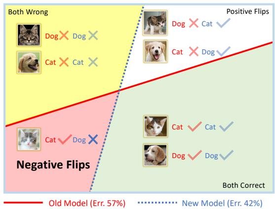
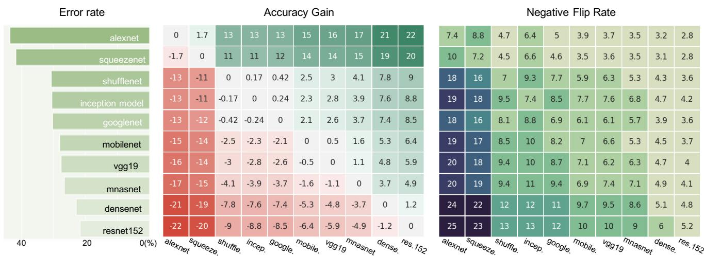
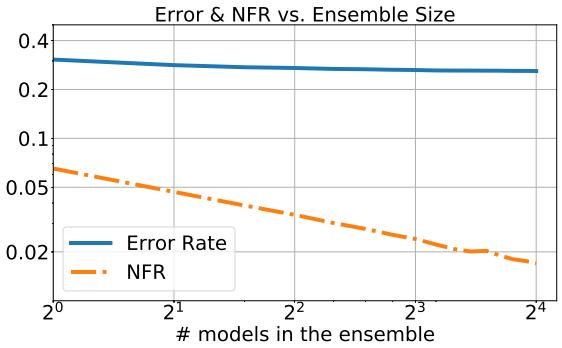
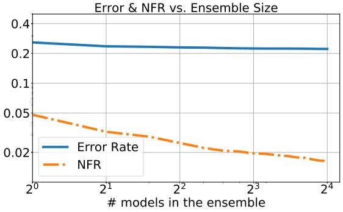
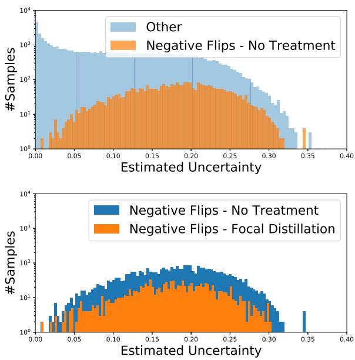
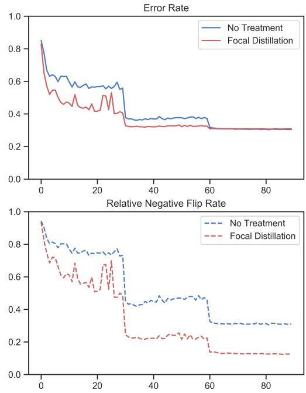

# Positive-Congruent Training: Towards Regression-Free Model Updates

Sijie Yan\* Yuanjun Xiong Kaustav Kundu Shuo Yang Siqi Deng Meng Wang Wei Xia Stefano Soatto

AWS/Amazon AI

yysijie@gmail.com, {yuanjx, kaustavk, shuoy, siqdeng, mengw, wxia, soattos}@amazon.com

## Abstract

Reducing inconsistencies in the behavior ofdifferent versions of an AI system can be as important in practice as reducing its overall error. In image classification, sample-wise inconsistencies appear as “negative flips”: A new model incorrectly predicts the output for a test sample that was correctly classified by the old (reference) model. Positivecongruent (PC) training aims at reducing error rate while at the same time reducing negative flips, thus maximizing congruency with the reference model only on positive predictions, unlike model distillation. We propose a simple approachfor PC training, Focal Distillation, which enforces congruence with the reference model by giving more weights to samples that were correctly classified. We alsofound that, ifthe reference model itselfcan be chosen as an ensemble of multiple deep neural networks, negativeflips can befurther reduced without affecting the new model’s accuracy.

## 1. Introduction

Imagine a “new and improved” version of the software that manages your photo collection exhibiting mistakes absent in the old one. Even if the average number of errors has decreased, every new mistake on your old photos feels like a step backward (Fig. 1), leading to perceived regression.1 We tackle regression in the update of image classification models, where an old (reference) model is replaced by a new (updated) model. We call test samples that are correctly labeled by both the new and the old models positive-congruent. On the other hand, negative flips are samples correctly classified by the old model but incorrectly by the new one. Their fraction of the total number is called negative flip rate (NFR), which measures regression. There are also positive flips, where the old model makes mistakes that the new one corrects, which are instead beneficial.

  
Figure 1: Regression in model update: When updating an old classifier (red) to a new one (dashed blue line), we correct mistakes (top-right, white), but we also introduce errors that the old classifier did not make (negative flips, bottom-left, red). While on average the errors decrease (from 57% to 42% in this toy example), regression can wreak havoc with downstream processing, nullifying the benefit of the update.

Reducing the NFR could be accomplished by reducing the overall error rate (ER). However, reducing the ER is neither necessary nor sufficient to reduce the NFR. In fact, models trained on the same data with different initial conditions, data augmentations, and hyperparameters tend to yield similar error rates, but with errors occurring on different samples. For instance, two ResNet152 models trained on ImageNet with just different initializations achieve the same accuracy of 78.3% but differ on 10.4% of the samples in the validation set (Fig. 2). Assuming an equal portion of positive and negative flips, updating from one model to another incurs a 5.2%NFR. This can be reduced simply by trading errors while maintaining an equal error rate. Thus, reducing the ER is not necessary to reduce the NFR. Reducing the ER to a value other than zero is not sufficient either: From Fig. 2 we see that, when updating an old AlexNet [16] to a new Resnet-152 [11] ER reduces significantly, but we still suffer a 3% NFR.

  
Figure 2: Differences in overall accuracy vs. negative flip rates. We measure the accuracy gains and negative flip rates on the ILSVRC12 [26] validation set when we update from various old models (y-axis) to new models (x-axis). Multiple CNN architectures [16, 11, 36] are used for comparison. First we observe training the same architecture twice can cause regression. If the new model has higher/lower capacity than the old one, the error rate decreases/increases (above/below the diagonal), but the NFR is always positive. Note that in some cases the NFR is of the same order of the error rate change.

On the other hand, NFR can be made zero trivially by copying the old model, albeit with no ER reduction. Model distillation tries to bias the update towards the old model while reducing the ER. However, we wish to mimic the old model only when it is right. Thus, regression-free updates are not achieved by ordinary distillation.

Reducing the error rate and the NFR are two separate and independent goals. We call any training procedure that aims to minimize both the error rate and the negative flip rate Positive-Congruent (PC) training, or PCT for short.

We first propose a simple method for PC training when the old model is given. In this case, PCT is achieved by minimizing an additional loss term along with the standard classification loss (empirical cross-entropy). We consider several variants for the additional loss, and find Focal Distillation (FD), a variant of the distillation loss that we introduce to bias the model towards positive congruence (Sect. 4.2), to be most effective (Sect. 5).

We also explore the problem of “future-proofing” the reference model to facilitate subsequent PC training. This forward setting pertains to selecting the reference model, rather than PC training new ones. Motivated by the observation above that different training instantiations can yield the same error rate with different erroneous samples, we propose a simple approach using ensembles. We show that this results in lower regression. In practice, ensembles are not viable at inference time in large-scale applications due to the high cost. Nonetheless, this approach can be used as a paragon for PC training of a single model in future works.

Our contributions can be summarized as follows: (i) We formalize the problem of quality regression in pairs of clas sifiers, and introduce the first method for positive congruent training (Sect. 3); (ii) we propose a variant of model distil lation (Sect. 4.2) to perform PC training of a deep neural network (DNN); (iii) we show that reference models can be adapted for future PC-Training by replacing a single model with an ensemble of DNNs (Sect. 4.3). We conduct experiments on large scale image classification benchmarks (Sect. 5), providing both a baseline (Focal Distillation) and a paragon (Ensemble) for future evaluation.

## 2. Related Work

PC training relates to the general areas of continual learning [6, 15, 29, 31], incremental learning [23, 18], open set recognition [1, 27], and sequential learning [10, 20]. The goal is to evolve a model to incorporate additional data or concepts, as reviewed in [8, 21]. Specifically, [10, 15, 19, 18, 23, 25, 35] aim at training with a growing number of samples, classes, and tasks while maintaining sim ilar performance to previously learned classes/tasks [20, 24].

PC training does not restrict the new model to reuse the old model weights or architecture. Instead, it allows changing them along with the training algorithm, loss functions, hyper-parameters, and training set. Unlike most work focused on reducing forgetting [5, 18, 19], PC training focuses on reducing NFR.

PC Training has strong connections to knowledge distillation [12] and weight consolidation [15], that aim to keep a model close to a reference one, regardless of whether they are correct or not. PC training focuses on enforcing similarity only on cohorts that belong to negative flips.

Along a similar vein, backward-compatible training [28, 30] aims to design new models that are inter-operable with old ones. PC training is a form of backwardcompatibility, but prior literature still measures compatibility using error rate, rather than NFR. As shown in experiments, these methods do not directly help reduce the NFR. Implicit negative flips during training of a single model are studied in [32]. We also conduct experiments on the evolution of negative flips during training of the new model.

## 3. Negative Flips in Model Updates

Let $x \in X$ (e.g., an image) and $y \in Y = \{ y _ { 1 } , . . . , y _ { K } \}$ (e.g., a label), identified with an integer in $\{ 1 , \ldots , K \}$ . Let p denote an unknown distribution from which a dataset is drawn $\mathcal { D } = \{ ( x _ { i } , y _ { i } ) \sim p ( x , y ) \} _ { i = 1 } ^ { N }$ . Let $p ^ { \mathrm { o l d } }$ be the pseudodistribution associated with the old (reference) model, and $p ^ { \mathrm { n e w } }$ the same for the new one.2 These are parametric functions that, ideally, approximate the true posterior which is the optimal (Bayesian) discriminant, in the sense of minimizing the expected probability of error. More specifically, when evaluated on the sample $( x _ { i } , y _ { i } ) , p ^ { \mathrm { n e w } } ( \cdot | \cdot )$ takes the form

$$
p ^ {\mathrm{new}} (y = y _ {i} | x = x _ {i}) = \frac {\exp (\langle \vec {y} _ {i} , \phi_ {w} ^ {\mathrm{new}} (x _ {i}) \rangle)}{\sum_ {j = 1} ^ {K} \exp (\langle \vec {y} _ {j} , \phi_ {w} ^ {\mathrm{new}} (x _ {i}) \rangle)}\tag{1}
$$

where $\vec { y } _ { i } \in \mathbb { R } _ { \geq 0 } ^ { K }$ is the “one-hot” (indicator) vector corresponding to the categorical variable $y _ { i } \in \{ 1 , \ldots , K \} . \ p ^ { \mathrm { o l d } }$ has a similar form but with a different architecture φ that has known parameters. We refer to $\phi _ { w }$ as the model or discriminant. The final class prediction of the model, $\phi _ { w }$ , is denoted by yˆ, where, $\hat { y } \left( x _ { i } \right) = \arg \operatorname* { m a x } _ { y } p \left( y | x _ { i } \right)$

## 3.1. Negative Flips

In Fig. 1 we illustrate the different errors occuring after a model upgrade, comparing the predictions $\hat { y } ^ { \mathrm { o l d } }$ and $\hat { y } ^ { \mathrm { n e w } }$ The consistent areas are where $\phi _ { w } ^ { \mathrm { o l d } }$ and $\phi _ { w } ^ { \mathrm { n e w } }$ are both either correct $( \hat { y } ^ { \mathrm { o l d } } ( x _ { i } ) = \hat { y } ^ { \mathrm { n e w } } ( x _ { i } ) = y _ { i } )$ or incorrect $( \hat { y } ^ { \mathrm { o l d } } ( x _ { i } ) \neq$ $y _ { i } , { \hat { y } } ^ { \mathrm { n e w } } ( x _ { i } ) \neq y _ { i } )$ . Positive flips occur when samples were incorrectly predicted by $\phi _ { w } ^ { \mathrm { o l d } }$ , but correctly predicted by $\phi _ { w } ^ { \mathrm { n e w } }$ The most relevant to this paper are negative flips, where samples flipped from correct $\phi _ { w } ^ { \mathrm { o l d } }$ to incorrect predictions $\phi _ { w } ^ { \mathrm { n e w } }$ . The negative flip rate (NFR) measures the fraction of samples that are negatives

$$
\mathrm{NFR} = \frac {1}{N} \sum_ {i = 1} ^ {N} \mathbf {1} (\hat {y} _ {i} ^ {\mathrm{new}} \neq y _ {i}, \hat {y} _ {i} ^ {\mathrm{old}} = y _ {i})\tag{2}
$$

where, 1(·) is the indicator function.

## 3.2. Persistence of Negative Flips

Deep neural network (DNN) classifiers are usually trained by minimizing the empirical cross-entropy (CE) loss:

$$
\min _ {w} \mathcal {L} _ {\mathrm{CE}} (\phi , w) = \min _ {w} \frac {1}{N} \sum_ {i = 1} ^ {N} - \log p _ {w} (y _ {i} | x _ {i})\tag{3}
$$

This objective is minimized by Stochastic Gradient Descent (SGD) [14] annealed to convergence to or near a local minimum.3 The final discriminant is determined by (a) the DNN architecture φ, (b) the training methodology, including opti mization scheme and associated hyper-parameters such as learning rate and momentum, $( \eta , \mu ) .$ , (c) the dataset on which the model is trained D and (d) the initialization $w ^ { ( 0 ) }$ . Unless explicitly enforced, a new model is typically not “close” to an old one. Even if based on the same architecture and trained on the same dataset, different runs on SGD can con verge to distant points in the loss landscape [4]. What is similar along limit cycles of solutions is the average error rate in the training set, which is minimal; what is different is the samples on which errors occur. These are negative flips, measured empirically in Fig. 2. There, we measure the difference of error rates and NFR between pairs of models trained on the ILSVRC12 [26] dataset4. We observe that, from earlier architecture design such as AlexNet [16], to recent ones such as DenseNet [13], although the overall error rates have dropped, the NFR remain non-negligible. In many cases, the NFR is of the same order of magnitude as the accuracy gain from the model update. This stubborn phenomenon calls for a dedicated solution that does not rely on reducing the error rate to zero in order to have regression-free model updates.

## 4. Positive Congruent Training

In most applications, the reference model is inherited and cannot be changed directly, so PC training is limited to the new model. However, in some cases we may get to design the reference model, aiming to make it easily updated with PCT. For the first “backward” case, we first present a simple approach to reducing NFR and achieve PCT. The idea is to simultaneously maximize the “both correct” region in Fig. 1, which measures positive congruence, along with the overall accuracy of the new model on the training set.

<table><tr><td>Approach</td><td> $\mathcal{F}$ </td><td> $\mathcal{D}$ </td><td> $q$ </td></tr><tr><td>Naive Basline</td><td> $\mathbf{1}(\hat{y}^{\text{old}}(x_i) = y_i)$ </td><td>Cross Entropy</td><td> $\vec{y}_i$ </td></tr><tr><td>Focal Distillation - KL (FD-KL)</td><td> $\alpha + \beta \cdot \mathbf{1}(\hat{y}^{\text{old}}(x_i) = y_i)$ </td><td> $\tau$ -scaled KL-Divergence</td><td> $p^{\text{old}}(y|x_i)$ </td></tr><tr><td>Focal Distillation - Logit Matching (FD-LM)</td><td> $\alpha + \beta \cdot \mathbf{1}(\hat{y}^{\text{old}}(x_i) = y_i)$ </td><td> $\ell_2$  distance</td><td> $\phi_w^{\text{old}}(x_i)$ </td></tr></table>

Table 1: Different approaches for targeted positive congruent training and the corresponding choices of F, D, and q in the PC loss functions.

To achieve PC Training, we use the following objective function

$$
\min _ {w} \mathcal {L} _ {\mathrm{CE}} (\phi^ {\mathrm{new}}, w) + \lambda \mathcal {L} _ {\mathrm{PC}} (\phi^ {\mathrm{new}}, w; \phi^ {\mathrm{old}})\tag{4}
$$

where $\mathcal { L } _ { \mathrm { C E } }$ is defined in (3) and $\mathcal { L } _ { \mathrm { P C } } ( \phi ^ { \mathrm { n e w } } , \phi ^ { \mathrm { o l d } } , w )$ is the positive congruence (PC) loss with multiplier λ. We propose a generic form of the PC loss function as

$$
\lambda \mathcal {L} _ {\mathrm{PC}} (\phi^ {\text { new }}, w; \phi^ {\text { old }}) = \mathcal {F} (x _ {i}) \mathcal {D} (\phi_ {w} ^ {\text { new }} (x _ {i}), q (x _ {i})),\tag{5}
$$

where $\mathcal { F }$ is a filter function $\mathcal { F } \in \mathcal { f } : X  \mathbb { R } _ { \ge 0 }$ that applies a weight for each training sample based on the model outputs and D is a distance function that measures the difference of the new model’s outputs to a certain target vector $q ( x _ { i } )$ conditioned on $x _ { i }$ . The PC loss serves to bias training towards maximal positive congruence. Favoring iso-error-rate solutions [4] with maximal positive congruence can lead to lower NFR relative to the reference model. In Table 1 we illustrate the different choices of $\mathcal { F }$ and D. We introduce different PC losses in the the next two sections.

## 4.1. Naive Baseline

We first consider a simple PC loss that measures CE on the samples where the old model made correct predictions, denoted as

$$
\mathcal {L} _ {\mathrm{PC}} ^ {\text { naive }} = \frac {1}{N} \sum_ {i = 1} ^ {N} - \mathbf {1} (\hat {y} ^ {\text { old }} (x _ {i}) = y _ {i}) \log p _ {w} ^ {\text { new }} (y _ {i} | x _ {i}).\tag{6}
$$

This is just a re-weighting of samples that the old models classified correctly by a factor 1 + λ. The resulting model is labeled “Naive” in the experiments in Sect. 5. This method does not help reduce the NFR: It is hard to find a suitable hyperparameter λ that gives sufficient weights to positive samples without inducing rote memorization. We now explore a more direct way to pass information from the old model to the new one.

## 4.2. Focal Distillation

Knowledge distillation [12] aims at biasing the new model to be “close” to the old one during training. In this sense it has the potential to reduce the NFR, but also to reduce positive flips, which are instead beneficial. Focal Distillation (FD) mitigates this risk by using the loss

$$
\mathcal {L} _ {\mathrm{PC}} ^ {\text { Focal }} = - \sum_ {i = 1} ^ {N} [ \alpha + \beta \cdot \mathbf {1} (\hat {y} ^ {\text { old }} (x _ {i}) = y _ {i}) ] \mathcal {D} (\phi_ {w} ^ {\text { new }}, \phi_ {w} ^ {\text { old }}),\tag{7}
$$

which penalizes a distance D between the output of the two models, weighted by a filtering function $\mathcal { F } = \alpha + \beta$ $\mathbf { 1 } ( \hat { y } ^ { \mathrm { o l d } } ( x _ { i } ) = y _ { i } )$ , to the target $q \ = \ \phi _ { w } ^ { \mathrm { o l d } } ( x _ { i } )$ The filter function applies a basic weight α for all samples in the training set and an additional weight to the samples correctly predicted by the old model. This biases the new model towards the old one for positive samples in the old model, thus imposing a cost on NFR as well as the overall error rate. When $\alpha = 1$ and $\beta = 0 .$ , focal distillation reduces to ordinary distillation [12]. When $\alpha = 0$ and $\beta > 0$ , we are only applying the distillation objective to the training samples predicted correctly by the old model. We assess these choices empirically in Sec. 5.2.

A possible choice of D is the temperature scaled KL divergence of [12]:

$$
\mathcal {D} ^ {\mathrm{KL}} (\phi_ {w} ^ {\text { new }}, \phi_ {w} ^ {\text { old }}) = \mathrm{KL} \left[ \sigma (\frac {\phi_ {w} ^ {\text { new }} (x _ {i})}{\tau}), \sigma (\frac {\phi_ {w} ^ {\text { old }} (x _ {i})}{\tau}) \right].\tag{8}
$$

Here, σ is the “Softmax” function as shown in Eq. (1) and $\tau$ is the temperature scaling factor. In Sec. 4.2, we found that τ has to be set to a large number $( e . g . \ \tau = 1 0 0 )$ for this PC loss to reduce NFR. In this case, the above approaches the distance among “logits” [12, 2]

$$
\mathcal {D} ^ {\mathrm{LM}} (\phi_ {w} ^ {\mathrm{new}}, \phi_ {w} ^ {\mathrm{old}}) = \frac {1}{2} \| \phi_ {w} ^ {\mathrm{new}} (x _ {i}) - \phi_ {w} ^ {\mathrm{old}} (x _ {i}) \| _ {2} ^ {2}.\tag{9}
$$

In Sect. 5 we compare various settings of FD with the naive baseline and observe that training with the FD can indeed reduce the NFR at the cost of a slight increase n average accuracy for the new model.

## 4.3. PC Training by Ensembles

The fact that there are iso-error sets in the loss landscape of DNN (loci in weight space that correspond to models with equal error $\mathrm { r a t e ^ { 3 } } )$ [4] can be used to our advantage to reduce NFR as outlined in the introduction. In some cases, one may be able to choose both the new and the old models in a manner that reduces the NFR. Geometrically, one can think of each model as representing an iso-error equivalence class: A sphere in the space of models, centered at zero error, where all models achieve the same error rate but differ by which samples they mistake. Since cordal averaging reduces the distance to the origin [34] and therefore the average distance to other models (for instance, future PC trained ones), we hypothesize that replacing each model with an ensemble trained on the same data might reduce the NFR.

In particular, we assume that $\phi ^ { \mathrm { o l d } }$ and $\phi ^ { \mathrm { n e w } }$ are trained independently, each from a collection of models $\{ \phi _ { j } ^ { \mathrm { o l d } } \} _ { j = 1 } ^ { N }$ and $\{ \phi _ { j } ^ { \mathrm { n e w } } \} _ { j = 1 } ^ { N }$ . We combine the results from all the models by averaging their discriminants

$$
p ^ {\text { ensemble }} \left(y | x _ {i}\right) = \sigma \left[ \frac {1}{L} \sum_ {j = 1} ^ {L} \phi_ {w _ {j}} ^ {\text { old }} \left(y | x _ {i}\right) \right].\tag{10}
$$

where $L$ is the number of models in the ensemble. Similarly, we can define $\phi ^ { \mathrm { n e w } }$ . Note that models in each ensemble are trained independently with different initialization.

We test our hypothesis empirically in Sect. 5 where we find that, indeed, the NFR between the two ensembles is lower than that between any two individual models.

While this may not seem surprising at first, since ensembles reduce error rate, we note that, as anticipated in the introduction, NFR can be reduced independently of ER. In fact, empirically we observe that the NFR decreases more rapidly than the average error as the size of the ensemble grows (Fig. 3), indicating that ensembling improves PC training beyond simply lowering the average error rate. Note the this phenomenon holds for any pair of ensembles with either the same or different architectures. This makes it suitable as a paragon to explore the upper limit of PC training. While test-time ensembles are not practical at scale, this observation points to promising areas of future investigation by collapsing ensembles.

## 5. Experiments

We test the methods presented on image classification tasks using ImageNet [9] and iNaturalist [33]. We start with the simplest case: same architecture and training data, different training runs. We compare baseline methods for PCT and emsembles. We then extend the approaches to encompass 1) architecture changes; 2) changing number of training samples per class; 3) increase in the number of classes. Finally, we present empirical evidence on the source of negative flips and how PC training affects them.

Relative NFR. Since overall error rate (ER) is an upper bound to the NFR, comparison is challenging across datasets

<table><tr><td rowspan="2">PCT Approach</td><td colspan="2">Error Rate (%)</td><td rowspan="2">NFR (%)</td><td rowspan="2">Rel. NFR (%)</td><td rowspan="2">#Params</td></tr><tr><td> $\phi^{old}$ </td><td> $\phi^{new}$ </td></tr><tr><td>No Treatment</td><td>30.24</td><td>30.29</td><td>6.44</td><td>30.48</td><td>12M</td></tr><tr><td>Naive</td><td>30.24</td><td>29.34</td><td>5.72</td><td>27.95</td><td>12M</td></tr><tr><td>BCT [28]</td><td>30.24</td><td>29.66</td><td>6.39</td><td>30.88</td><td>12M</td></tr><tr><td>FD-KL</td><td>30.24</td><td>30.63</td><td>2.50</td><td>11.70</td><td>12M</td></tr><tr><td>FD-LM</td><td>30.24</td><td>30.47</td><td>2.35</td><td>11.06</td><td>12M</td></tr><tr><td>Ensemble</td><td>26.07</td><td>25.98</td><td>1.70</td><td>8.85</td><td>187M</td></tr></table>

(a) ILSVRC12

<table><tr><td rowspan="2">PCT Approach</td><td colspan="2">Error Rate (%)</td><td rowspan="2">NFR (%)</td><td rowspan="2">Rel. NFR (%)</td><td rowspan="2">#Params</td></tr><tr><td> $\phi^{old}$ </td><td> $\phi^{new}$ </td></tr><tr><td>No Treatment</td><td>40.69</td><td>41.06</td><td>7.77</td><td>31.91</td><td>14M</td></tr><tr><td>Naive</td><td>40.69</td><td>45.47</td><td>11.07</td><td>41.05</td><td>14M</td></tr><tr><td>FD-KL</td><td>40.69</td><td>41.81</td><td>2.83</td><td>11.41</td><td>14M</td></tr><tr><td>FD-LM</td><td>40.69</td><td>41.78</td><td>2.71</td><td>10.94</td><td>14M</td></tr><tr><td>Ensemble</td><td>35.68</td><td>35.42</td><td>2.01</td><td>8.82</td><td>221M</td></tr></table>

(b) iNaturalist

Table 2: Experiments on training the same model architec ture multiple times on three datasets: (a) ILSVRC12 [26], (b) iNaturalist [33]. Applying PC training in the case can significantly reduce the NFR without hurting the new model’s ac curacy. Among them, the focal distillation works the best for the backward compatibility setting. “Ensemble” refers to PC training with ensembles in the forward setting. “Rel. NFR” refers to the relative NFR value shown in Eq.11. “#Params” refers to the number of parameters of the new model.

with different ERs. For this reason, we introduce the relative NFR:

$$
\mathrm{NFR} _ {\text {rel}} = \frac {\mathrm{NFR}}{\left(1 - \mathrm{ER} _ {\text {old}}\right) * \mathrm{ER} _ {\text {new}}},\tag{11}
$$

where $\mathrm { E R } _ { \mathrm { n e w } }$ and $\mathrm { E R } _ { \mathrm { o l d } }$ denote the error rate of $\phi _ { \mathrm { n e w } }$ and $\phi _ { \mathrm { o l d } }$ The denominator is the expected error rate on the subset of samples predicted correctly by the old model. This is a naive estimation of NFR if the two models are independent of each other. The relative NFR is a measure of reduction in regression from a PCT method which factors out overall model accuracy.

## 5.1. Implementation Details

Unless otherwise noted, we minimize the CE loss (3) with batch-size 2048 for 90 epochs on each dataset. The learning rate starts at 0.1 and decreases by 1/10 every 30 epochs. We use $\lambda = 1$ for Eq. 4. Focal distillation and ensembles are implemented with PyTorch [22]. Models in Fig. 2 are from the PyTorch model zoo.

## 5.2. Positive Congruent Training

We start with the same architecture [11] trained twice on the same dataset, either ILSVRC12 [26] or iNaturalist [33], and report results on their official validation sets in Table $2 ^ { 5 }$ Variants of PCT include the naive baseline in Eq. 6, which unfortunately does not reduce the NFR markedly. Yet it is worth noting that, due to the fact that models are not independent, being trained on the same data, their relative NFR are always less than 100%. We additionally evaluate the recently proposed BCT method [28] for aligning representation between models. It does not reduce NFR.

Focal distillation in Eq. 7 (FD) has two variants, either using the KL-divergence after soft-max (FD-KL) or matching logits before soft-max (FD-LM). In FD, there are two parameters, α and $\beta ,$ controlling the filter function F. We set $\alpha = 1$ and $\beta = 5$ in this set of experiments. The results on ILSVRC12 are summarized in Table 2a. We see that training with both variants of focal distillation, we can reduce the NFR from 6% to around 2.5%, a 60% relative reduction. We also note that the reduction of NFR comes as the cost of a slightly increased error rate of the new model.

Finally we evaluate the ensemble approach. We use two independently trained ensembles each composed of 16 ResNet-18 [11] for $\phi ^ { \mathrm { o l d } }$ and $\phi ^ { \mathrm { o l d } }$ . We see ensembles achieve the lowest absolute NFR, as low as 1.7%. Even when discounting the accuracy gain of ensembles, we also observe better relative NFR than other approaches in the backward setting. The price to pay is computational cost, a multiplier depending on the number of models in the ensemble.

Training from scratch vs fine-tuning. In practical scenarios, we often fine-tune from an existing model pretrained on a large-scale dataset. To compare the impact of this, on the ImageNet dataset we trained all models from scratch but on the iNaturalist dataset [33] we fine-tune from model weights pretrained on ImageNet. As shown in Table 2b, we observe starting from a common pretrained model does not guarantee regression-free. We observe a 7% NFR without treatment in finetuning on iNaturalist. But with PC training, we can reduce the NFR to 2.01%

Distances in focal distillation In focal distillation we presented two different choices of distance. In Table 2, we observe that the logit matching distance function (FD-LM) leads to marginally better NFR reduction. It is also worth to note that the KL-divergence only effectively reduces NFR when the temperature scaling parameter τ becomes large, say 100, at which point it resembles logit matching [12].

Weights and focus in focal distillation In Focal Distillation, we use a default focal weight $\beta = 5$ and a base weight $\alpha = 1$ . We now experiment changing the focal weight and base weight and report results in Table 3. First note two special cases: 1) $\alpha = 0$ and $\beta = 1$ , when we only apply distillation to samples classified correctly by the old model, which is ineffective: The new model must still learn the old model’s behavior from all samples in order to be able to overcome negative flips. 2) $\alpha = 1$ and $\beta = 0 ,$ corresponding to ordinary distillation, which can help reduce NFR only to a limited extent. Focal Distillation is most effective when $\alpha = 1$ and β is between 5 to 10, reducing NFR to 2.35%.

<table><tr><td> $\alpha$ </td><td> $\beta$ </td><td> $\phi^{\text{new}}$  Error Rate (%)</td><td>NFR (%)</td><td>Rel. NFR(%)</td></tr><tr><td>0</td><td>0</td><td>30.29</td><td>6.44</td><td>30.48</td></tr><tr><td>0</td><td>1</td><td>31.52</td><td>5.25</td><td>23.88</td></tr><tr><td>1</td><td>0</td><td>31.12</td><td>3.90</td><td>17.96</td></tr><tr><td>1</td><td>1</td><td>30.59</td><td>2.75</td><td>12.89</td></tr><tr><td>1</td><td>2</td><td>30.79</td><td>2.73</td><td>12.71</td></tr><tr><td>1</td><td>5</td><td>30.47</td><td>2.35</td><td>11.06</td></tr><tr><td>1</td><td>10</td><td>30.44</td><td>2.39</td><td>11.26</td></tr><tr><td>1</td><td>20</td><td>33.55</td><td>6.94</td><td>29.65</td></tr></table>

Table 3: Effect of different α and β values in focal distillation. We train ResNet-18 for both $\phi ^ { \mathrm { o l d } }$ and $\phi ^ { \mathrm { n e w } }$ on ILSVRC12 dataset [26]. We use the logit matching distance function for focal distillation because it has better effect in reducing NFR.

Impact of ensemble size In ensemble experiments on ILSVRC12, we used a default ensemble size of 16. In Figure 3 we explore the behavior of NFR as the number of components in an ensemble changes. Although the accuracy plateaus with the growing ensemble size, the NFR keeps decreasing in a logarithmic scale. This observation is also confirmed in the case of ensembles with different architec tures. Although having a large ensemble is impractical for real-world applications, these results corroborate the geo metric picture sketched in Sect. 4.3 and suggest that it may be possible to achieve zero NFR in a model update without having to drive the ER to zero, which may be infeasible, as suggested in the Introduction.

## 5.3. Other Changes in Model Updates

Having studied the simplest case of PC training, we now move to more practical cases of image classification model updates. We enumerate and study the following types of changes: 1) model architecture; 2) number of training sam ples per class; 3) number of classes.

Changing model architectures to a larger model, with either a similar architecture (Resnet-18 to Resnet-50) or a dissimilar one (ResNet18 to DenseNet-161) , yields results summarized in Table 4. A larger model is expected to have a lower overall error rate. However, without any treatment, it still suffers from a significant number of negative flips. We then apply the focal distillation approach in this case, we see a redution in NFR, although the new model incurs a slight increase in error rate. We also observe that ensembles reduce NFR, this time without increasing the new model’s error rate. This is noteworthy because the two ensembles in this case do not share any information other than the dataset on which they are trained. In Fig. 3 we also visualize the trend of NFR vs. the ensemble size. It suggests that, even in the case of architecture changes, it may be possible to achieve zero NFR.

Error & NFR vs. Ensemble Size  
  
(a) ResNet-18 → ResNet-18

  
(b) ResNet-18 → ResNet-50  
Figure 3: The effect of ensemble size (number of individual models) on error rates and the NFRs when both the old and new models are both independently trained ensembles. Results are reported on ILSVRC12. (a) shows the results when the old model and new one are both composed of ResNet-18 [11] models. (b) shows the case when the old model is an ensemble of ResNet-18 [11] models and the new one is formed by ResNet-50 [11] models. In both case, the error rates plateau quickly but the NFRs keep decreasing as the ensemble size increases.

Increasing training samples per visual category is shown in Table 5a for the ILSVRC12 dataset, with the old model trained on all 1000 classes using 50% of the samples per category, and the new model trained on 100% set. We observe that all new models decrease the ER, but PC trained ones achieve better reduction of NFR.

Increasing the number of classes is tested on ILSVRC12 with the old model trained on a random subset of 500 classes and the new model on the entire ILSVRC12 training set. We use ResNet-50 for this study. The evaluation is done on the validation subset which comprises all samples of the original 500 classes on which the older model is trained on. The results are shown in Table 5b. Since the number of categories increase for the newer model, so does the total error on the validation set. Yet, PC training is able to reduce NFR.

<table><tr><td rowspan="2">Approach</td><td colspan="2">Error Rate (%)</td><td rowspan="2">NFR (%)</td><td rowspan="2">Rel. NFR (%)</td><td rowspan="2">#params</td></tr><tr><td> $\phi^{old}$ </td><td> $\phi^{new}$ </td></tr><tr><td>No Treatment</td><td>30.24</td><td>25.85</td><td>4.89</td><td>27.12</td><td>25M</td></tr><tr><td>Naive</td><td>30.24</td><td>24.41</td><td>3.78</td><td>22.20</td><td>25M</td></tr><tr><td>FD-KD</td><td>30.24</td><td>26.32</td><td>2.90</td><td>15.79</td><td>25M</td></tr><tr><td>FD-LM</td><td>30.24</td><td>26.53</td><td>2.92</td><td>15.78</td><td>25M</td></tr><tr><td>Ensemble</td><td>26.07</td><td>22.20</td><td>1.64</td><td>9.99</td><td>409M</td></tr></table>

(a) ResNet-18 → ResNet-50

<table><tr><td rowspan="2">Approach</td><td colspan="2">Error Rate (%)</td><td rowspan="2">NFR (%)</td><td rowspan="2">Rel. NFR (%)</td><td rowspan="2">#params</td></tr><tr><td> $\phi^{old}$ </td><td> $\phi^{new}$ </td></tr><tr><td>No Treatment</td><td>30.24</td><td>22.86</td><td>4.03</td><td>25.24</td><td>25M</td></tr><tr><td>Naive</td><td>30.24</td><td>21.60</td><td>3.28</td><td>21.76</td><td>25M</td></tr><tr><td>FD-KD</td><td>30.24</td><td>23.52</td><td>2.50</td><td>15.24</td><td>25M</td></tr><tr><td>FD-LM</td><td>30.24</td><td>23.83</td><td>2.56</td><td>15.40</td><td>25M</td></tr></table>

(b) ResNet-18 → DenseNet161

Table 4: Experiments of PC training methods in changes of model architectures on ILSVRC12 [26]. Here the old model architecture is ResNet-18 [11]. We experiment with the new models with both Resnet-50 [11] and Denset161 [13] architectures. Results suggest that PC training method are effective in reducing regression in the face of model architecture changes.

<table><tr><td rowspan="2">Approach</td><td colspan="2">Error Rate (%)</td><td rowspan="2">NFR(%)</td><td rowspan="2">Rel. NFR(%)</td><td rowspan="2">#params</td></tr><tr><td> $\phi^{old}$ </td><td> $\phi^{new}$ </td></tr><tr><td>No Treatment</td><td>28.58</td><td>23.65</td><td>3.98</td><td>19.47</td><td>25M</td></tr><tr><td>Naive</td><td>28.45</td><td>24.46</td><td>3.27</td><td>18.68</td><td>25M</td></tr><tr><td>FD-KD</td><td>28.45</td><td>25.20</td><td>2.89</td><td>15.84</td><td>25M</td></tr><tr><td>FD-LM</td><td>28.45</td><td>24.77</td><td>2.85</td><td>16.09</td><td>25M</td></tr><tr><td>Ensemble</td><td>26.39</td><td>22.09</td><td>2.75</td><td>16.88</td><td>100M</td></tr></table>

(a) Increase in # samples

<table><tr><td rowspan="2">Approach</td><td colspan="2">Error Rate (%)</td><td rowspan="2">NFR (%)</td><td rowspan="2">Rel. NFR (%)</td><td rowspan="2">#params</td></tr><tr><td> $\phi^{old}$ </td><td> $\phi^{new}$ </td></tr><tr><td>No Treatment</td><td>19.30</td><td>23.65</td><td>8.05</td><td>41.90</td><td>25M</td></tr><tr><td>Naive</td><td>19.28</td><td>23.74</td><td>7.70</td><td>40.20</td><td>25M</td></tr><tr><td>FD-KD</td><td>19.28</td><td>24.14</td><td>7.07</td><td>36.29</td><td>25M</td></tr><tr><td>FD-LM</td><td>19.28</td><td>25.11</td><td>7.37</td><td>36.35</td><td>25M</td></tr><tr><td>Ensemble</td><td>17.53</td><td>21.98</td><td>6.72</td><td>37.06</td><td>100M</td></tr></table>

(b) Increase in # classes  
Table 5: Experiments of training data change on ILSVRC12 [26] dataset. We use Renset-18 architecture for both $\phi ^ { \mathrm { o l d } }$ and $\phi ^ { \mathrm { o l d } }$

## 5.4. Prediction of negative flips

First we look at the potential relationship between a test sample being a negative flip and its prediction uncertainty. In this experiment we use the uncertainty estimated by a deep ensemble of ResNet-18 [11] as described in [17]. We visualize the results in Fig. 4. We observe that test samples that become negative flips have relatively high estimated uncertainty but our measure does not clearly separate them from other samples. We also visualize the histogram of uncertainty estimates before and after we apply focal distillation based PCT, as shown in Fig. 4. We observe that PCT with focal distillation reduces the NFR with an almost uniform chance for samples with different level of uncertainty. This observation may suggest alternate strategies to designing PC training methods.

  
Figure 4: Distribution of sample uncertainty estimated by [17], measured on test validation set of ILSVRC12 [26]. Here we use ResNet-18 [11] as the model architecture in experiment’s. Top: Uncertainty histogram of negative flipped samples and other test samples between two ResNet-18 models trained without PC training. Bottom: Uncertainty histogram of negative flippped sample in two model pairs, the first without PC training. The new model in the second pair is trained with focal distillation based PC training. The y-axes are in log-scale.

The second study is on the evolution of negative flip rates during the training of the new model. We visualize the relative NFRs and error rates at every epoch when training a new model. We present results for both training without PCT and with focal distillation based PCT (FD-LM) in Fig. 5. Our first observation is that the NFRs change in a similar trend as the new models’ error rates and reduce as the models are trained longer. By applying PCT during training, we observe that the relative NFR drops faster in early epochs compared with no treatment. As training goes on, the new model with PCT maintains the same gap in NFR until the training terminates.

  
Figure 5: Evolution of error rates and relative NFR during training of the new models on ILSVRC12 [26]. We compare focal distillation-based PC training with no treatment. Generally NFR follows the trend of the error rate during trainig. Focal distillation lead to a gap in relative NFR in early epochs and keeps the gap as training evolves.

## 6. Discussion

Large-scale DNN-based classifiers are typically only a part of more complex systems that involve additional post processing. In the simplest cases, the output of the DNN is used to map the data to a metric space, where it is clustered and searched. In more complex cases, classifiers are part of an elaborate system that includes high-level reasoning. In all cases, changing the classifier can break the system, which is why DNN models are seldom updated despite the steady improvements reported in the literature. PC training could enable seamless adoption of improved models, and ensure steady progress and increased accessibility to the state of the art in image classification. In this paper, we have merely scratched the surface of PC training, as the methods proposed have obvious limitations: Ensembling is not viable in large-scale systems, even though it achieves the highest NFR reduction. Focal distillation reduces the NFR, but at the price of a slight increase in error rate. Further exploration is needed to identify methods that can achieve paragon performance at the baseline cost of single model distillation.

## References

[1] Abhijit Bendale and Terrance E Boult. Towards open set deep networks. In CVPR, 2016. 2

[2] Cristian Bucila, R. Caruana, and Alexandru Niculescu-Mizil. Model compression. In KDD, 2006. 4

[3] Pratik Chaudhari, Anna Choromanska, Stefano Soatto, Yann LeCun, Carlo Baldassi, Christian Borgs, Jennifer Chayes, Levent Sagun, and Riccardo Zecchina. Entropy-sgd: Biasing gradient descent into wide valleys. Journal of Statistical Mechanics: Theory and Experiment, 2019(12):124018, 2019. 3

[4] Pratik Chaudhari and Stefano Soatto. Stochastic gradient descent performs variational inference, converges to limit cycles for deep networks. In ITA, 2018. 3, 4, 5

[5] Arslan Chaudhry, Puneet K Dokania, Thalaiyasingam Ajanthan, and Philip HS Torr. Riemannian walk for incremental learning: Understanding forgetting and intransigence. In ECCV, 2018. 3

[6] Zhiyuan Chen and Bing Liu. Lifelong machine learning. Synthesis Lectures on Artificial Intelligence and Machine Learning, 2018. 2

[7] Anna Choromanska, Mikael Henaff, Michael Mathieu, Gérard Ben Arous, and Yann LeCun. The loss surfaces of multilayer networks. In Artificial intelligence and statistics, 2015. 3

[8] Matthias De Lange, Rahaf Aljundi, Marc Masana, Sarah Parisot, Xu Jia, Ales Leonardis, Gregory Slabaugh, and Tinne Tuytelaars. Continual learning: A comparative study on how to defy forgetting in classification tasks. arXiv:1909.08383, 2019. 2

[9] Jia Deng, Wei Dong, Richard Socher, Li-Jia Li, Kai Li, and Li Fei-Fei. Imagenet: A large-scale hierarchical image database. In CVPR, 2009. 5

[10] Ian J Goodfellow, Mehdi Mirza, Da Xiao, Aaron Courville, and Yoshua Bengio. An empirical investigation of catastrophic forgetting in gradient-based neural networks. arXiv:1312.6211, 2013. 2

[11] Kaiming He, Xiangyu Zhang, Shaoqing Ren, and Jian Sun. Deep residual learning for image recognition. In CVPR, 2016. 2, 5, 6, 7, 8

[12] Geoffrey Hinton, Oriol Vinyals, and Jeffrey Dean. Distilling the knowledge in a neural network. In NIPS Deep Learning and Representation Learning Workshop, 2015. 3, 4, 6

[13] Gao Huang, Zhuang Liu, Laurens van der Maaten, and Kilian Q Weinberger. Densely connected convolutional networks. In CVPR, 2017. 3, 7

[14] Jack Kiefer, Jacob Wolfowitz, et al. Stochastic estimation of the maximum of a regression function. The Annals of Mathematical Statistics, 23(3):462–466, 1952. 3

[15] James Kirkpatrick, Razvan Pascanu, Neil Rabinowitz, Joel Veness, Guillaume Desjardins, Andrei A Rusu, Kieran Milan, John Quan, Tiago Ramalho, Agnieszka Grabska-Barwinska, et al. Overcoming catastrophic forgetting in neural networks. Proceedings of the national academy of sciences, 114(13):3521–3526, 2017. 2, 3

[16] Alex Krizhevsky, Ilya Sutskever, and Geoffrey E Hinton. Im agenet classification with deep convolutional neural networks. Communications ofthe ACM, 60(6):84–90, 2017. 2, 3

[17] Balaji Lakshminarayanan, Alexander Pritzel, and Charles Blundell. Simple and scalable predictive uncertainty estima tion using deep ensembles. In NIPS, 2017. 8

[18] Zhizhong Li and Derek Hoiem. Learning without forgetting. TPAMI, 40(12):2935–2947, 2017. 2, 3

[19] David Lopez-Paz and Marc’Aurelio Ranzato. Gradient episodic memory for continual learning. In NIPS, 2017. 2, 3

[20] Michael McCloskey and Neal J Cohen. Catastrophic interference in connectionist networks: The sequential learning problem. In Psychology oflearning and motivation. 1989. 2

[21] German I Parisi, Ronald Kemker, Jose L Part, Christopher Kanan, and Stefan Wermter. Continual lifelong learning with neural networks: A review. Neural Networks, 113:54–71, 2019. 2

[22] Adam Paszke, Sam Gross, Francisco Massa, Adam Lerer, James Bradbury, Gregory Chanan, Trevor Killeen, Zeming Lin, Natalia Gimelshein, Luca Antiga, Alban Desmaison, An dreas Kopf, Edward Yang, Zachary DeVito, Martin Raison, Alykhan Tejani, Sasank Chilamkurthy, Benoit Steiner, Lu Fang, Junjie Bai, and Soumith Chintala. Pytorch: An im perative style, high-performance deep learning library. In H. Wallach, H. Larochelle, A. Beygelzimer, F. d'Alché-Buc, E. Fox, and R. Garnett, editors, NIPS. 2019. 3, 5

[23] Ameya Prabhu, Philip Torr, and Puneet Dokania. Gdumb: A simple approach that questions our progress in continual learning. In ECCV, 2020. 2

[24] Roger Ratcliff. Connectionist models of recognition mem ory: constraints imposed by learning and forgetting functions. Psychological review, 1990. 2

[25] Sylvestre-Alvise Rebuffi, Alexander Kolesnikov, Georg Sperl, and Christoph H Lampert. icarl: Incremental classifier and representation learning. In CVPR, 2017. 2

[26] Olga Russakovsky, Jia Deng, Hao Su, Jonathan Krause, Sanjeev Satheesh, Sean Ma, Zhiheng Huang, Andrej Karpathy, Aditya Khosla, Michael Bernstein, Alexander C. Berg, and Li Fei-Fei. ImageNet Large Scale Visual Recognition Challenge. IJCV, 2015. 2, 3, 5, 6, 7, 8

[27] Walter J Scheirer, Anderson de Rezende Rocha, Archana Sapkota, and Terrance E Boult. Toward open set recognition. TPAMI, 35(7):1757–1772, 2012. 2

[28] Yantao Shen, Yuanjun Xiong, Wei Xia, and Stefano Soatto. Towards backward-compatible representation learning. In CVPR, 2020. 3, 5, 6

[29] Daniel L Silver and Robert E Mercer. The task rehearsal method of life-long learning: Overcoming impoverished data. In Conference of the Canadian Society for Computational Studies of Intelligence, 2002. 2

[30] Megha Srivastava, Besmira Nushi, Ece Kamar, Shital Shah, and Eric Horvitz. An empirical analysis of backward compatibility in machine learning systems. In KDD, 2020. 3

[31] Sebastian Thrun. Lifelong learning algorithms. In Learning to learn, pages 181–209. Springer, 1998. 2

[32] Mariya Toneva, Alessandro Sordoni, Remi Tachet des Combes, Adam Trischler, Yoshua Bengio, and Geoffrey J

Gordon. An empirical study of example forgetting during deep neural network learning. arXiv:1812.05159, 2018. 3

[33] Grant Van Horn, Oisin Mac Aodha, Yang Song, Yin Cui, Chen Sun, Alex Shepard, Hartwig Adam, Pietro Perona, and Serge Belongie. The inaturalist species classification and detection dataset. In CVPR, 2018. 5, 6

[34] Geoffrey S Watson. Statistics on spheres. Wiley-Interscience, 1983. 5

[35] Friedemann Zenke, Ben Poole, and Surya Ganguli. Continual learning through synaptic intelligence. ICML, 2017. 2

[36] Hang Zhang, Chongruo Wu, Zhongyue Zhang, Yi Zhu, Zhi Zhang, Haibin Lin, Yue Sun, Tong He, Jonas Mueller, R Manmatha, et al. Resnest: Split-attention networks. arXiv:2004.08955, 2020. 2