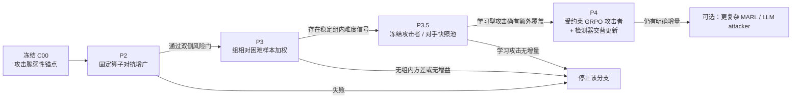

# DRIFT 场景下 LLM-DGA、学习型对抗域名生成、GRPO 与双侧学习博弈文献调研

## 执行摘要与核验口径

**状态：外部候选，待本地全文和实验复核，必须由发起方独立复核；不改变既有冻结合同、实验裁决或 T20–T25 的只评价地位。**

| 返回字段 | 本次实际情况 |
|---|---|
| `actual_model` | **GPT-5.5 Thinking** |
| `actual_effort` | **high**；按高强度文献核对执行，后台内部计算档位不可由本报告独立审计 |
| `actual_mode` | **deep-research** |
| `used_apps` | **Web、Consensus（仅用于文献发现，不作为下文引用依据）**；未访问 GitHub 仓库 |
| Git 状态 | 未修改 Git、未运行代码、未访问白名单外路径 |
| 证据边界 | 公开论文原文/预印本 + 用户提供的脱敏实验摘要；用户本地实验数字均视为“已报告实测”，本报告没有复现 |
| 安全边界 | 仅讨论离线防御评测和鲁棒训练设计；不提供攻击部署代码、真实 C2 流程、可操作攻击基础设施或数据 |

### 核心结论

**第一，直接的“学习型 DGA 攻击者”并不是新概念，甚至“攻击者和检测器双方同时学习”也至少可以追溯到 DeepDGA。** Anderson、Woodbridge 与 Filar 的 DeepDGA 在 2016 年已经把字符级生成器和 DGA 检测器置于一系列对抗轮次中：生成器逐步产生更难检测的域名，检测器反过来更新。这一点意味着，P4 的创新差量**不能**落在“第一次让攻击者和检测器一起学习”，而必须落到更具体的训练动力学、组相对信用分配、受约束动作空间、对手池或非平稳稳定化上。DeepDGA §III 给出了生成/检测框架，其摘要和 §I 已明确描述双侧迭代学习。citeturn33view0turn20view1

**第二，没有证据支持“越复杂、越学习型的攻击器一定比简单固定算子强”。** 最干净的同协议反例来自 MaskDGA：Sidi、Nadler、Shabtai 在相同四个 DGA 分类器和 DMD-2018 数据上报告，未攻击平均 F1 为 0.977，MaskDGA 后降至 0.495，而 DeepDGA 生成样本对应 0.780；也就是说，在该实验里，更复杂的生成式 DeepDGA 反而弱于一个以代理模型梯度决定字符替换的攻击。citeturn37view0turn37view1 CharBot 更进一步说明一个**完全黑盒、随机两字符替换**的极简单机制就能形成很强的基线，而且论文发现单纯用 CharBot 样本重训练并不能充分解决问题。citeturn20view0 因而用户现在坚持 **P2 → P3 → P4 按“离已验证干预的距离”递进**，有很强的文献依据。

**第三，本轮没有核验到一个成熟、已发表且直接满足“通用/指令式 LLM 作为 DGA 攻击生成器，并以 DGA 检测器反馈训练”的代表性原始工作。** 检索到的 LLM-DGA 论文主要是在**检测侧**：Sayed 等使用微调 LLM 检测 59 个真实 DGA 家族；Leyva La O 等使用 Llama 3 8B 做 DGA 检测，而不是攻击生成。citeturn24academia3turn24academia5 因此，目前不应把 DeepDGA、DomainGAN、PKDGA 之类的小型任务化神经生成器改称“LLM-DGA”；**“LLM attacker”反而是当前文献缺口较大的高风险方向，而不是最成熟的下一步。**

**第四，真正最接近 P4 的 RL-DGA 原始先例是 PKDGA，但它不是 one-shot RL。** Nie 等将域名按 token 逐步生成，以当前 token 前缀为状态、下一个 token 为动作、完整域名的外部反馈为奖励，并用 Monte-Carlo 搜索估计中间前缀的未来回报；这是一个明确的多步序列 MDP。citeturn31view2turn31view3turn32view0turn32view1 你的方案反而可以**有意识地与 PKDGA 区分**：把“完整受约束扰动域名”视作一个字符串级动作，将问题压成 horizon \(H=1\) 的 contextual-bandit/normal-form game。这样不需要为字符序列再引入 Bellman 信用分配，而 GRPO 的组相对优势恰好可以作用在同一原域名产生的候选组上。

**第五，P3 必须谨慎命名。** 若攻击器仍是 CharBot/MaskDGA 等固定生成器，只是把同一原域名的 \(K\) 个候选按组内相对难度加权后训练检测器，**这不是 GRPO 本身**，因为不存在被策略梯度更新的攻击策略、概率比值或策略目标；准确称呼应是“**GRPO-style group-relative hard-example weighting / 组相对困难样本加权**”。原始 GRPO 的关键创新是省去 value critic，并以同一问题的一组采样输出的相对奖励估计 advantage，再更新生成策略。citeturn31view4turn32view3

**第六，如果 P3 过门，不建议直接跳到“两个玩家每步同步更新”的 P4。最有文献支撑的中间形态是 P3.5：冻结对手 → 近似最佳响应 → 保存快照 → 对手池混合训练。** PSRO 明确通过对**策略混合**求近似最佳响应来降低只对当前对手过拟合的问题；MADDPG 也通过集中式 critic 和 policy ensemble 针对多智能体非平稳性。citeturn34academia0turn30view0 对只有一次扰动动作的 DGA 游戏而言，策略池/PSRO 比重型 MADDPG 更自然。

---

## DGA 对抗生成文献：从固定算子到学习型与 LLM 边界

### 代表工作逐项对照

下表只把**原论文已经做过的机制**写成其原名，不将成熟算法重新包装成创新。核验状态中的“全文已核验”表示本轮直接检查了原始全文/作者预印本相应位置；“摘要已核验”表示只核到原始论文摘要，因此不能据此虚构细节。

| 工作 | 问题形式化与攻击者 | 学习信号 / 目标 | 一步还是多步 | 约束与可用性 | 数据与评价 / 主要结果 | 核验 |
|---|---|---|---|---|---|---|
| **DeepDGA** — Anderson, Woodbridge, Filar；ACM AISec 2016；§III | 字符级神经域名生成器与检测器形成 GAN 式对抗训练；双方在对抗轮次中更新 | 生成器学习骗过检测器，检测器学习区分生成域名；前置 autoencoder 学 Alexa 域名表示 | 字符生成内部为序列模型；训练层面是生成器—检测器反复博弈 | 学习 benign-like 域名分布；并非“小编辑保持原家族”攻击 | Alexa Top 1M 等；生成域名可以跨模型骗过手工特征 RF，并可用于增强训练改善对未见 DGA 家族的检测；本轮没有从正文可靠抽取统一数值表 | **全文已核验** citeturn33view0 |
| **CharBot** — Peck et al.; arXiv 2019／公开发表版本；§III、§V | **固定、黑盒**：从良性 SLD 出发随机换两个字符，无需目标模型知识 | 无学习信号 | 单次字符串操作 | 两字符替换；论文以 Levenshtein 距离和域名是否可使用来讨论 adversarial cost | Alexa/Bambenek/Qname；攻击 FANCI、LSTM.MI、B-RF；作者报告大量 CharBot 域名逃过检测，并发现简单重训练不足 | **全文已核验** citeturn20view0 |
| **MaskDGA** — Sidi, Nadler, Shabtai；arXiv 2019／后续公开版本；§3–§5 | 黑盒迁移攻击：训练代理分类器，再用 saliency 找要改的字符；所以**不是纯固定随机算子** | 代理模型梯度；目标是将 DGA 判成 benign | 一次对完整 AGD 执行确定数量替换；优化信号来自代理模型 | 合法字符、固定修改数、一个位置只改一次；强调 uniqueness / validity / rareness | DMD-2018、4 个检测器；平均 F1 **0.977→0.495**；DeepDGA 对照为 **0.780**；AT/蒸馏只部分缓解 | **全文已核验** citeturn37view0turn37view1 |
| **DomainGAN** — Corley, Lwowski, Hoffman；arXiv 2019；§4 | GAN、LSGAN、WGAN-GP 三种生成 DGA，拟合 benign 域名特性 | GAN 判别损失 | 生成内部为序列；不是基于一个已有恶意域名的小编辑 one-shot | 专门测已有域名 collision 和重复 collision，避免只看“骗分类器” | benign Alexa 1M + Bambenek DGA 1M；6 个 DGA classifier。WGAN-GP existing collision 12.3%、重复 collision 7.4%，优于 GAN/LSGAN；论文称 WGAN-GP 是三者中攻防用途最优 | **全文已核验** citeturn37view2turn21view3 |
| **PKDGA** — Nie, Shan, Zhao, Li；IEEE TIFS 论文版本/2022 预印本；§III-B | **部分知识 RL 攻击者**；只利用外部可观察反馈学习生成器 | 完整域名的外部反馈 \(R(Y)\)；policy gradient；中间前缀用 MC search 估计未来回报 | **多步 token MDP**：状态是已生成前缀、动作是下一 token | 构造合法 2LD，并讨论 TLD/3LD；但奖励与真实域名可用性耦合较强 | 论文摘要报告现有检测性能由 **91.7% 降至 52.5%**；还做了 Mirai 原型评估。不是 DRIFT 同协议比较 | **全文已核验** citeturn31view1turn31view2turn31view3 |
| **Drichel et al.** — *Towards Robust DGA Classification*；ASIA CCS 2024；§4.3–§5.5 | 系统化白盒离散/embedding 对抗攻击，而非单一生成器 | 梯度白盒攻击 + 多种离散化；防御端对抗训练 | 依攻击类型不同 | 强调离散域名必须可映射回有效字符串 | **32** 个 white-box attack，其中 **19** 个使未加固分类器 FNR 约 100%；joint AT 比仅 embedding AT 平均 FNR 好 **10.15 个百分点**、比仅 discrete AT 好 **3.6 个百分点**；部分攻击仍达 94–96% FNR | **全文已核验** citeturn37view6turn31view5turn31view6 |
| **Sayed et al.** — 2024，LLM-DGA detection | LLM 是**检测器**，不是攻击者 | DGA/DNS exfiltration SFT | 不适用 | 不适用 | 59 个真实 DGA 家族；作者报告未知 DGA 上优于传统 NLP 方法 | **原始摘要已核验** citeturn24academia3 |
| **Leyva La O et al.** — 2024，LLM-DGA detection | Llama 3 8B 检测器，比较 ICL/SFT | SFT / ICL | 不适用 | 不适用 | 68 家族；SFT 版本报告约 **94% accuracy、4% FPR** | **原始摘要已核验** citeturn24academia5 |

### 固定攻击器与学习型攻击器：目前证据真正说明了什么

最重要的结论不是“学习型攻击器更强”，而是**攻击器容量与攻击强度没有单调关系**。

CharBot 在 §III 将攻击简化成两个字符替换，而且完全不需要目标模型；其作者还专门论证增加更多随机替换反而更容易让字符串显得随机、被 DGA 检测器识别。citeturn20view0 MaskDGA 则利用代理模型的梯度选择位置/替换，因此比 CharBot 多一层学习信息，但仍是一个受限字符编辑器；它在同协议实验中明显优于 DeepDGA 生成样本。citeturn37view0turn37view1

Drichel 等进一步提供了一个很强的现代反例：他们分析对抗样本后发现模型存在连字符偏差，随后构造非常简单的 HyphenDGA，就能在其设置中达到平均约 **99.9% FNR**，与昂贵的梯度白盒攻击处于同一强度级别。换句话说，**学习型攻击最有价值的作用可能不是“生成本身更复杂”，而是发现检测器的漏洞，再把漏洞蒸馏成很便宜的攻击策略。** 这对 P4 的章节定位非常关键。citeturn37view7

因此，对你当前已报告的本地结果——MaskDGA 式扰动在 FPR=1% 工作点使检出率相对下降 69.1%，CharBot 式两位替换下降 33.6%——合理的文献解释是：**你已经有两个相当强的已验证固定/半学习攻击锚点，P4 必须证明“持续适应攻击策略”带来的增量，而不是仅证明“可以产生难样本”。** 这些本地百分比由用户提供，本报告未独立复现。

### 防御端现状

Drichel 等的证据目前最直接支持**多攻击、多表示空间的 adversarial training**：§4.4 区分 embedding-space AT、discrete-domain AT 与 joint AT，并在训练 batch 中覆盖多个攻击与扰动预算；joint AT 的平均鲁棒性优于单一表示空间 AT，但仍留下 HotFlip 等高 FNR 攻击。citeturn31view5turn31view6turn32view2 这意味着 P2 “固定攻击 adversarial augmentation”本身已有强成熟近邻，而 P3/P4 的差量必须通过**训练样本选择/权重或对手动力学**体现。

CharBot 和 MaskDGA 两篇论文都指出，只靠域名字符串会留下根本脆弱面，并建议利用额外 DNS/query/behavioral side information。citeturn20view0turn37view0 对 DRIFT 而言，这不是免费防御：如果当前协议严格是 domain-string-only，那么引入 DNS 解析、IP、查询频率等上下文会改变输入协议，应作为另一类系统基线而非直接替换 C00。

TENT、CoTTA、SAR 属于**分布漂移的测试时适应**，不是已经证明能抵抗 DGA adversarial evasion 的专门防御。TENT 用目标测试样本熵最小化更新归一化参数；CoTTA 针对持续非平稳测试域加入 weight/augmentation averaging 与随机恢复；SAR 针对小 batch、动态类别分布和适应坍塌加入可靠样本筛选与 sharpness-aware 更新。citeturn34academia3turn35academia1turn35academia0 **本轮没有核验到这些方法在 DGA 对抗规避上的直接实证，因此它们最多是 DRIFT 的独立适应协议候选，不应写成 P2–P4 对抗训练已证实的防御机制。**

---

## 单步 RL／LLM 攻击形式化：什么是真正的 one-shot，以及怎么防 reward hacking

### PKDGA 是直接 RL 先例，但恰好说明你的形式化可以不同

PKDGA §III-B 明确把生成写成：

\[
s_t=[y_0,y_1,\dots,y_{t-1}],
\qquad
a_t=y_t,
\qquad
s_{t+1}=[s_t,y_t],
\]

最终得到：

\[
Y=[y_1,\dots,y_T],
\qquad
R(Y)=\text{external feedback}(Y).
\]

由于中间前缀无法直接评价，论文用 Monte-Carlo completion 为中间动作估计未来奖励。citeturn31view2turn31view3turn32view1 这正是典型**序列 MDP**。

DRIFT 的对抗扰动问题其实可以做得更小。令原始恶意域名为 \(x\)，检测器为 \(D_\theta\)，攻击策略一次输出**完整受约束域名**：

\[
\tilde x\sim\pi_\phi(\cdot\mid x),\qquad
\tilde x\in\mathcal A(x).
\]

于是环境层面的 episode 就是：

\[
s=x,\quad a=\tilde x,\quad H=1,\quad r=r_\theta(x,\tilde x).
\]

这里虽然 Transformer/LLM 内部仍然按 token 自回归生成，但从 RL 环境的视角，**整个 completion 是一个 action**。这类“response-level action”并非没有先例：MAGRPO §3.3 明确讨论 token-level 与 prompt/response-level 两种动作粒度，并选择完整 response 映射来缩短 horizon；§4 再在完整响应组上计算 Monte-Carlo group-relative advantage。citeturn27view1

这使你的 P4 更接近 **contextual bandit + policy gradient**，而不是 MADDPG 所针对的长时域 Markov game。

### 奖励最好把“可行性”做成硬约束，而不是允许模型用奖励权衡

最危险的形式是：

\[
r_{\text{naive}}
=
\mathbf 1[D_\theta(\tilde x)<\tau].
\]

因为攻击者只知道“骗过了没有”，不知道自己是否还在研究问题定义内。它可能发现预处理漏洞、无效字符串、重复域名、异常长度或某种训练集偏差；Drichel §5.5 的连字符漏洞就是非常现实的例子——攻击优化可以优先找到模型捷径，而不是你原先想研究的“家族内有效扰动”。citeturn37view7

更稳妥的形式是先定义**可行集合**：

\[
\mathcal A_b(x)
=
\left\{
\tilde x:
\begin{array}{l}
\text{ValidSyntax}(\tilde x)=1,\\
d_{\mathrm{edit}}(x,\tilde x)\le b,\\
\text{PreserveContract}(x,\tilde x)=1
\end{array}
\right\},
\]

攻击策略只能在其中采样，然后才计算检测收益：

\[
r_\theta(x,\tilde x)
=
g\!\left(
\tau-p_\theta(y=\mathrm{DGA}\mid\tilde x)
\right),
\quad
\tilde x\in\mathcal A_b(x).
\]

其中 \(g\) 可采用有界的连续 margin 映射，而不是只有 0/1 的 bypass 成功。这样做有两个好处：避免 K 个候选全部同奖导致组相对 advantage 为零，也避免通过无限扩大置信 margin 让一个极端样本统治梯度。这是针对 DRIFT 的设计推论，并非现成论文方法。

### “保持恶意语义”在 DGA 里要比 NLP 说得更严格

DGA 域名并没有自然语言任务里那种容易定义的“句义”。所以建议区分三个概念：

| 约束 | 能证明什么 | 不能证明什么 |
|---|---|---|
| **编辑距离上界** \(d_\text{edit}\le b\) | 扰动与原字符串足够接近；直接对齐 CharBot/字符攻击 | 不能证明仍由原生 DGA 算法产生 |
| **family-origin preserving** | \(\tilde x\) 是从某家族已有 AGD 经过受控 wrapper 得到 | 不能称为“原家族生成分布中的原生样本” |
| **family-generator preserving** | 修改发生在该家族真实可控生成机制内，并仍满足其生成契约 | 最强，但需要家族算法知识，不适用于所有数据 |
| **syntactic validity** | DNS 字符、长度、标签结构合法 | 不代表实际可注册、未占用或能承担恶意通信 |
| **词法/语言过滤** | 排除明显退化字符串、极端重复等 | 不能代替 operational validity |

CharBot 本身就用 Levenshtein 距离讨论离散域名的 adversarial cost，并指出域名可用性是与图像 \(L_p\) 约束不同的重要问题。citeturn20view0 MaskDGA 则强调其修改必须保持合法字符、固定修改数，并希望维持域名 uniqueness、validity 和 rareness。citeturn37view0 DomainGAN 进一步把**已有域名碰撞和重复生成碰撞**单列成攻击可用性指标；WGAN-GP 在其实验中这两项分别为 12.3% 和 7.4%。citeturn37view2

为了保持本课题是防御评测，正式实验不需要、也不建议通过真实域名注册或真实 C2 活动验证“攻击可用性”。本地可以采用**离线确定性约束 + 数据来源契约 + 碰撞/重复统计**作为研究代理，并明确其不等价于实战部署有效性。

### 最典型的 reward-hacking 预注册

| 失败模式 | 表面现象 | 预注册防线 |
|---|---|---|
| **预处理漏洞 hacking** | 大量候选集中出现同一特殊字符/长度 | 每轮监控字符、长度、token 分布；将这些当审计项而非奖励项；Drichel 的 hyphen 现象是直接先例 citeturn37view7 |
| **无效字符串逃逸** | detector score 极低但字符串不满足 DNS 语法 | 先硬投影/拒绝，无效样本 reward 不进入 GRPO group |
| **编辑预算逃逸** | 学习器不断增加编辑以获得更高 bypass | \(d_\text{edit}\le b\) 做硬约束；P4 首臂建议 \(b=2\) 与 CharBot 可比 |
| **模式坍缩** | 大量原域名生成相同或极相似候选 | 报告 group unique ratio、全局 duplicate rate；不把多次重复成功算独立收益 |
| **benign-copy shortcut** | 攻击器学会输出看似良性但与原 DGA 无关的名字 | 必须从原 AGD 做局部 edit policy，而非首臂就让 LLM自由重写完整域名 |
| **detector overfit** | 对当前 \(\theta_t\) 很强，换快照/重训检测器立即消失 | held-out detector snapshot / opponent pool |
| **家族丢失** | 总体 attack success 高，但主要来自少数易攻击家族 | family-wise TPR/FNR、家族宏平均、每族有效候选覆盖率 |

这也是为何我**不建议 P4 第一版直接放开一个通用 LLM 自由生成域名**。受限 edit-policy 能把“攻击能力”与“生成语义失控”分离，且与用户已经实测的 CharBot/MaskDGA 建立更干净的因果链。

---

## MARL 的非平稳性技术：哪些值得借，哪些对单步 DGA 是重武器

### 非平稳问题不是假设，而是 P4 的结构属性

MADDPG 的出发点就是：多个智能体同时改变策略后，对每个单独 agent 来说环境变成非平稳；过去经验对应的转移分布也随其他 agent 的 policy 变化。Lowe 等 §1–§4.1 因此使用 **centralized training with decentralized execution**：agent \(i\) 的 critic 可见全部 agent 的动作，

\[
Q_i(x,a_1,\ldots,a_N),
\]

而执行时 actor 仍只使用自己的局部 observation。论文还提出为每个 agent 使用 policy ensemble，以迫使策略对多种合作方/竞争者鲁棒。citeturn30view0

但 DRIFT 的 P4 有一个决定性的简化：**环境动作只有一次字符串扰动，没有长时序状态转移。** 所以很多为 temporal credit assignment 设计的 MARL 组件，在这里没有充分理由。

### 稳定化技术对 DRIFT 的可借用性

| MARL / 博弈技术 | 原问题 | DRIFT 单步双人博弈适配度 | 建议 |
|---|---|---:|---|
| **Opponent / policy ensemble** — Lowe et al., NeurIPS 2017 §1, §4 | 不让策略只适应唯一同时更新的对手 | **高** | 攻击者面对若干 detector snapshot；检测器面对 CharBot、MaskDGA、当前 attacker、旧 attacker 的混合。直接抑制循环追逐和单对手过拟合。citeturn30view0 |
| **PSRO / fictitious-play family** — Lanctot et al. 2017 | 对策略混合求近似最佳响应；降低 InRL 对当前对手 policy 的过拟合 | **非常高** | \(H=1\) 本来就接近 normal-form game。比先建一个时序 critic 更自然。citeturn34academia0 |
| **Centralized critic / MADDPG** — Lowe et al. §4.1 | 用联合信息稳定多智能体 actor-critic | **低到中** | 可做成熟 MARL 对照，但字符串动作极大、离散，且无长期 return；critic 学 \(Q(x,a_A,a_D)\) 很可能比问题本身更难。citeturn30view0 |
| **Population Based Training** — Jaderberg et al. 2017 | 同时进化模型及超参日程，提高训练稳定性 | **中** | 更适合 P4 已确定有效之后调学习率/温度/更新比；不解决攻击/防守 payoff 本身，首轮不要上。citeturn36academia4 |
| **Meta-learning adaptation** — Al-Shedivat et al., ICLR 2018 | 在动态竞争环境中用少量交互快速适应新对手 | **中偏低** | 若以后研究“新攻击者到来后的 few-shot defense”很合适；当前只是两方训练，额外元学习层没有必要。citeturn36academia5 |
| **LOLA** — Foerster et al., 2018 | 在自己的梯度里考虑“我的动作将如何改变对手下一次更新” | **低** | 与“攻击者预测 detector 下一次 SGD”概念相合，但需要 higher-order opponent-learning term；本课题已有梯度冲突史，首轮风险明显高于收益。citeturn36academia7 |
| **MAGRPO centralized group advantage** — Liu et al. 2025 §3–4 | 无大型 critic，用一组 Monte-Carlo joint responses 构造集中式相对 advantage | **中到高，作为结构参考** | 与你的“同原域名 K 个候选”非常接近，但原工作是合作、多轮 LLM MAS，不是攻防零和 DGA；只能作为算法结构先例。citeturn27view1 |
| **AlphaStar-style league** | 用户指定的历史类比 | **概念上高** | 可借“主策略不只面对最新对手”的思想；**本轮未完成 Nature 原文精确节号核验，不作为负载性证据** |

Hernandez-Leal 等关于 multiagent non-stationarity 的分类进一步把处理思路归纳为从 ignore、forget、respond to target models、learn models 到 theory of mind 的层次；核心问题就是对手本身也在适应，使“最佳响应目标”持续移动。citeturn34academia2 对 DRIFT 来说，没必要一开始跳到 theory-of-mind。**对手池就是最小、最贴近病灶的稳定化。**

用户指定的 Hernandez-Leal 等 *A Survey and Critique of Multiagent Deep Reinforcement Learning*、李艺春等 2025、杜威/丁世飞 2019、罗彪等 2025、Tampuu et al. 2017、Tan 1993 已纳入待本地综述核对清单，但**本轮没有逐篇重新打开这些全文，因此其具体节号和二手归纳均标记为“未核验”，不用于支撑上表中的具体机制结论。**

### “league”不一定要做成 AlphaStar 规模

DRIFT 可用的最小版本只需维护：

\[
\mathcal P_D=
\{D_0,D_{t-1},D_t\},
\qquad
\mathcal P_A=
\{A_{\text{CharBot}},A_{\text{Mask}},A_{t-1},A_t\}.
\]

每次优化一个玩家时，从对手池的固定混合中采样对手，而不是只与“最新版本”对战。这在思想上已经完成最关键的去追逐化：

\[
\max_{\phi}\;
\mathbb E_{D\sim \mu_D}
[R_A(\pi_\phi,D)],
\]

而不是：

\[
\max_{\phi}\;
R_A(\pi_\phi,D_t).
\]

严格来说，这更接近 PSRO/策略混合思想，而不是完整 league 系统。PSRO 的原论文正是从“independent learner 会过拟合当前其他 agent policy”出发，改为面对 policy mixture 训练近似最佳响应。citeturn34academia0

---

## GRPO × MARL：已经有哪些先例，以及它与 MADDPG 本质不同在哪里

### 原始 GRPO 不是 MARL

DeepSeekMath §4.1 的 GRPO 从 PPO 出发，但删除单独的 value model。对同一问题 \(q\)，从旧策略生成一组输出：

\[
\{o_1,\ldots,o_G\},
\]

得到奖励 \(r_i\)，再用组内相对成绩构造 advantage。原文明确指出，GRPO **foregoes the critic/value model and estimates the baseline from group scores**，从而减少 PPO 中 value model 的显存和计算负担。citeturn31view4turn32view3

这与你 P3 的“同一域名 \(K\) 个扰动”为一组高度相似，但需要强调：

> **相似的是 advantage 的统计结构，不是算法身份。**

P3 若没有攻击策略更新，只是困难样本加权，就不能叫 GRPO training。

### 多智能体 GRPO 已经出现，但直接的攻击—防守先例仍不足

到本轮检索时间点，已经能核验到至少一个明确的 **Multi-Agent GRPO** 原始预印本：Liu、Liang、Lyu、Amato 的 MAGRPO（2025）。他们把多个 LLM 形式化为 cooperative MARL，§3.3 讨论 token-vs-response action 粒度，§4 对多个 agent 的 joint response group 计算一个集中的 Monte-Carlo relative advantage，而**不训练大型 centralized value critic**。citeturn27view1

其 advantage 是：

\[
\hat A_t^{(g)}
=
R_t^{(g)}
-\frac1G\sum_{j=1}^{G}R_t^{(j)},
\]

再用这个 centralized group estimate 更新各 agent 的本地 policy。原文明确把它描述为“centralized estimate without a large value model”。citeturn27view1

此外，2026 年已有名为 MAGRPO 的 CTDE 变体将 group-relative advantage 用于传统多智能体无线优化，并明确用它替换 MAPPO 的 critic；这说明“critic-free group-relative MARL”已经不是空白概念。citeturn25academia3 **但这些检索到的直接先例主要是 cooperative MARL，并不能证明已有成熟工作完成了你所设想的“GRPO 攻击者 + 同步学习检测器”的对抗 DGA 游戏。** 因而“group-relative advantage 用于多智能体”不能作为你的新意，“受约束单步 DGA 攻防中的双侧训练动力学”仍可能是差量所在，但需要进一步正式查新。

### GRPO 与 MADDPG 的概念差异

| 维度 | GRPO / group-relative policy gradient | MADDPG |
|---|---|---|
| **核心估值器** | 同一条件下一组 rollout 的相对 reward | 学习 \(Q_i(x,a_1,\ldots,a_N)\) critic |
| **需要 value critic 吗** | **不需要**；这是 GRPO 的关键设计 | **需要**；每个 agent 有 centralized critic |
| **信用来源** | 同一状态/问题下不同采样的横向相对表现 | critic 对联合状态—联合动作的估计 |
| **时间信用** | 原 GRPO可用于序列，但 group reward 是核心；在你的 \(H=1\) 情况几乎无 Bellman 必要 | TD target、replay、target network 是 DDPG/MADDPG 核心组成 |
| **其他 agent 信息** | 原始单 agent GRPO 不关心；MAGRPO 可以从 joint group reward 构造 centralized estimate | critic 显式看到其他 agent 动作/信息 |
| **离散字符串动作** | 很自然：policy 给完整候选的 log-probability | 原 MADDPG基于 deterministic policy gradient，更自然处理连续动作；直接套到巨大离散字符串动作并不自然 |
| **训练非平稳性** | 单独 GRPO **不解决**对手持续更新；仍需 snapshot/pool/交替冻结 | centralized critic 显式条件于 joint actions，可部分缓解 moving target |
| **内存成本** | 没有同规模 value model，但需 \(K\) 个 group samples | actor + centralized critic + target nets + replay |
| **DRIFT 适配** | **高**，尤其攻击器 \(H=1\)、\(K\) 候选结构 | **更适合作为 MARL 机制对照，而非首选实现** |

GRPO 侧依据来自 DeepSeekMath §4.1；MADDPG 侧依据来自 Lowe et al. §3–§4.1。citeturn31view4turn30view0

一个尤其重要的章节论证点是：

\[
\text{P3 group weighting}
\neq
\text{GRPO}
\neq
\text{MAGRPO}
\neq
\text{MADDPG}.
\]

只有 P4 中真正存在可学习的攻击 policy \(\pi_\phi\)，并依据 group-relative advantage 更新 \(\phi\)，才具有 GRPO-style policy optimization。若 detection model 仍用 BCE 更新，则整体更准确的表述是：

> **critic-free group-relative attacker + supervised adversarially trained defender 的双侧学习博弈**

而不是直接称“两边都用 MARL”。要严格宣称 MARL，需要把双方都明确放入 Markov-game policy/reward 框架，并证明这个建模比普通 minimax/adversarial training 多出了实质机制。

---

## DRIFT 的 P2–P4 路线：先证伪固定攻击训练，再逐层增加“学习对手”

### 总体路线

这里 T17–T19 承担所有设计、调参、攻击器训练与消融；**T20–T25 不进入 reward、hard-example selection、对手池选择、阈值搜索或早停，只能在全部方法冻结后进入最终评价。** 这沿用用户之前明确的 DRIFT 研究边界，而非文献本身的要求。

### P2：固定攻击 adversarial augmentation

**目的不是创新，而是建立“已验证攻击 → 已验证防御干预”的最低锚点。** Drichel §4.4 已说明 discrete-domain AT 是成熟方法家族，因此 P2 应被明确标成强基线。citeturn31view5turn32view2

| 项目 | 最小可复现实验规格 |
|---|---|
| Detector | 原 DRIFT 24.2M 字符+子词 Transformer，结构和阈值协议不变 |
| Attacker | **CharBot 式固定两字符 perturbation**；首臂不引入 learned selector |
| 动作空间 | 仅对源期恶意域名产生编辑距离 \(\le2\) 的 DNS-valid 变体；不改变实验定义之外字段 |
| Loss | clean BCE + adversarial DGA BCE；首臂 \(\lambda=1\)，不额外安全约束优化 |
| Batch | clean benign + clean DGA + fixed adversarial DGA；各比例预注册且保持整个实验不变 |
| Metrics | clean FPR/FNR、固定 FPR 工作点 TPR、CharBot/MaskDGA robust TPR、family-wise TPR、family macro TPR、paired swap table |
| 预算 | screening 单种子；训练 epoch 上限与 C00 重训对齐，不因 P2 额外寻找更有利 epoch |
| 第一个证伪 | 只训练短预算：若 CharBot robust TPR 上升但 clean FPR 明显恶化，立即说明“鲁棒性以良性代价购买”，不进入 P3 |

这里的 paired swap 建议对每个样本比较 C00 与 P2：

\[
\begin{array}{c|cc}
& P2\ correct & P2\ wrong\\
\hline
C00\ correct & kept & induced\\
C00\ wrong & rescued & shared\ error
\end{array}
\]

并按 benign/DGA 分开。这样可以防止只看平均 F1 隐藏双侧交换。

### P3：组相对困难样本加权，而不是冒充 GRPO

对每个源期恶意域名 \(x_i\)，固定攻击器产生 \(K\) 个合法候选：

\[
\tilde x_{i1},\ldots,\tilde x_{iK}.
\]

由当前 detector 给每个候选一个**困难度** \(r_{ik}\)，例如 DGA 真类损失或有界反向 margin，然后只在组内归一化：

\[
A_{ik}
=
\frac{r_{ik}-\bar r_i}
{\sigma_i+\varepsilon}.
\]

定义 detached 权重：

\[
w_{ik}
=
\frac{\exp(A_{ik}/T)}
{\sum_j\exp(A_{ij}/T)},
\]

检测器训练为：

\[
L_D
=
L_{\text{clean}}
+
\lambda
\sum_i\sum_k
w_{ik}\,
\operatorname{BCE}
(D_\theta(\tilde x_{ik}),1).
\]

这就是 P3 真正的差量：**不是生成新攻击类型，而是使 detector 在固定攻击集合中优先吸收“当前版本仍不会的变体”。** DeepSeekMath 的 group-relative 思想可作为结构启发，但不能写成“直接应用 GRPO”，因为这里没有 attack policy gradient。citeturn31view4turn32view3

**P3 第一个甚至不需要训练的证伪实验**应当检查组内信息量。对源期固定 C00 生成 K 组候选，统计：

\[
P(\sigma_i \approx 0),\qquad
\operatorname{median}(\sigma_i),
\qquad
P(\exists k,j:r_{ik}>r_{ij}).
\]

如果绝大多数 group 都是“全都骗过”或“全都骗不过”，则 \(A_{ik}\) 近零，组相对机制没有信用分配信号。此时不应该靠调 temperature 制造差异。

**建议首轮 \(K=4\)**，并维持用户已经规划的“每半 epoch 刷新权重”，但用相同总 adversarial sample budget 做 P2/P3 计算公平性对照。\(K=4\) 是本报告的预算建议，不是文献规定。

### P3.5：最值得加的一层——预训练/冻结攻击者 + 对手池

如果 P3 通过，这是我认为**比立即双侧同步 MARL 更有信息价值**的一步。

阶段 A：冻结 \(D_0\)，只训练一个受约束 attacker \(A_1\)。

阶段 B：冻结 \(A_1\)，用

\[
\{CharBot,\ MaskDGA,\ A_1\}
\]

的混合训练 \(D_1\)。

阶段 C：冻结一个 detector pool：

\[
\{D_0,D_1\},
\]

训练 \(A_2\) 面对二者的固定混合，而不是只面对 \(D_1\)。

这已经是简化的 policy-population / PSRO-style alternating response。PSRO 的核心依据正是独立学习会对当前对手策略过拟合，而对**策略混合**求近似最佳响应可以缓解这个问题。citeturn34academia0 Lowe 等的 policy ensemble 也出于类似鲁棒性动机。citeturn30view0

**P3.5 首要证伪：**

\[
ASR(A_1,D_0)
\gg
ASR(A_1,D_{\text{held-out}})
\]

若在不同 detector snapshot 上攻击收益几乎消失，说明学习器只学到了单模型漏洞；此时 P4 同步学习更容易演化为追逐循环，不值得升级。

### P4：受约束 GRPO attacker + adversarially-trained detector

首版 P4 **不建议使用通用大 LLM**。更合理的是一个小型受约束 edit-policy，因为你的科学问题是“学习攻击策略是否比固定攻击器提供增量”，而不是“几十亿参数语言模型是否能够记住 benign lexical prior”。

攻击策略可以是小型字符 Transformer，例如仅编码原始域名 \(x\)，输出一个完整的**编辑集合动作**：

\[
a
=
\{(i_1,c_1),\ldots,(i_m,c_m)\},
\qquad m\le2.
\]

执行动作后得到 \(\tilde x=T(x,a)\)。这样在游戏层面始终是 \(H=1\)，同时严格对齐 CharBot 两字符预算。模型具体层数/hidden size应由本地资源固定；为避免容量成为主要解释变量，首轮宜远小于 24.2M detector。

攻击 reward 可取：

\[
r_A(x,\tilde x;D)
=
g\!\left(
\tau-p_D(y=\mathrm{DGA}\mid\tilde x)
\right),
\quad \tilde x\in\mathcal A_2(x).
\]

从一个 \(x\) 采样 \(K\) 个动作：

\[
a_1,\ldots,a_K\sim\pi_{\phi_{\rm old}}(\cdot|x),
\]

再计算：

\[
A_k
=
\frac{r_k-\bar r}{s_r+\epsilon}.
\]

攻击器才在这里真正进行 GRPO-style policy update：

\[
L_A
=
-
\frac1K
\sum_k
\min
\left[
\rho_kA_k,\
\operatorname{clip}(\rho_k,1-\epsilon_c,1+\epsilon_c)A_k
\right]
+
\beta
D_{\mathrm{KL}}
(\pi_\phi\Vert\pi_{\rm ref}),
\]

其中

\[
\rho_k
=
\frac{\pi_\phi(a_k|x)}
{\pi_{\phi_{\rm old}}(a_k|x)}.
\]

这一结构来自 GRPO 的 critic-free relative advantage 逻辑；用于 DGA 是任务化候选，并非 DeepSeekMath 已经做过的应用。citeturn31view4turn32view3

防守端仍然执行监督对抗训练：

\[
L_D
=
L_{\rm clean}
+
\lambda
\,
\mathbb E_{\tilde x\sim\pi_\phi}
[\operatorname{BCE}(D_\theta(\tilde x),1)].
\]

**第一版不要每 mini-batch 同时更新 \(\phi,\theta\)。** 最小稳定版本是 two-timescale alternating：

1. 冻结 detector pool，更新 attacker 若干 block；
2. 固定 attacker snapshot；
3. 用 fixed operators + attacker pool 更新 detector；
4. 把新 detector 放入 pool；
5. 下一轮攻击器面对 detector mixture。

这不是因为同步 MARL“不正确”，而是因为 MADDPG 与 MARL 文献明确指出“其他 agent 同时更新”本身就会制造 moving-target non-stationarity。citeturn30view0turn34academia2

建议首个 P4 screening 只做 **2 个攻防轮次、\(K=4\)、有限源期子集**。真正的通过条件不是 attack success 越来越高，而是同时看到：

\[
\begin{aligned}
&\text{learned attacker 对 held-out detector 的 ASR}
>
\text{fixed attacker baseline},\\
&\text{P4 detector robust TPR}
>
\text{P3 detector},\\
&\Delta FPR_{\rm benign}\le0,\\
&\text{family macro TPR 不由少数大族掩盖}.
\end{aligned}
\]

如果只有第一项成立，说明你训练出了更强攻击器，但还没有更好的防御章；如果只有第二项在当前 attacker 上成立而 held-out attack 不改善，则更可能是 co-adaptation。

### P2–P4 的最小矩阵

| 臂 | 攻击器是否学习 | 组相对机制 | detector 是否更新 | 对手池 | 回答的科学问题 |
|---|---:|---:|---:|---:|---|
| C00 | 否 | 否 | 原模型 | 否 | 静态锚点 |
| P2 | 否 | 否 | 是 | 否 | 单纯 fixed AT 是否已经足够 |
| P3-uniform | 否 | 否 | 是 | 否 | 多候选本身是否有增益 |
| P3-relative | 否 | **是** | 是 | 否 | 增益是否来自组相对困难度，而非多采样 |
| P3.5-frozen | **预训练后冻结** | 可有 | 是 | 否 | learned attacker 是否比固定攻击器提供新困难样本 |
| P3.5-pool | 是，交替冻结 | 可有 | 是 | **是** | snapshot mixture 是否缓解对当前对手过拟合 |
| P4-no-pool | **是** | **GRPO-style** | 是 | 否 | 双侧更新本身的收益/不稳定性 |
| P4-pool | **是** | **GRPO-style** | 是 | **是** | 最终差量是否来自对手多样性和稳定化 |

这比直接拿 P2、P3、P4 三个总模型比一张表更重要，因为它能把“固定 AT”“更多候选”“组相对加权”“learning attacker”“对手池”五个因素拆开。

---

## 综合裁决建议、风险边界与待核验文献

### P4 是否值得在 P3 过门后投入

**外部候选意见：值得保留，但只有在 P3 过门之后，而且优先做 P3.5，而不是直接上 full MARL/LLM。**

文献给出的正面依据有三条。

其一，DeepDGA 已经证明 DGA 的生成者可以随着 detector 学习而发生变化，而且生成的攻击域名可以跨到不同架构。citeturn33view0 因而“自适应攻击者有可能扩大训练覆盖”不是凭空假设。

其二，PKDGA 表明只利用可观察反馈的 RL generator 在 DGA 上确实可以学习，而不是必须拿到 detector 内部梯度；其论文摘要报告检测性能由 91.7% 降到 52.5%。citeturn31view1turn31view2 这给 P4 的 policy-learning 攻击侧提供了直接先例。

其三，PSRO/MADDPG/MAGRPO 分别提供了**对手混合、集中式对手信息、critic-free group-relative estimate**三条成熟稳定化路线。citeturn34academia0turn30view0turn27view1

但负面依据同样强。MaskDGA 同协议击败 DeepDGA 的结果说明，“learning attacker”不保证比受约束字符攻击强。citeturn37view0turn37view1 Drichel 还显示非常简单的模型漏洞攻击就能逼近复杂梯度攻击的效果，而且 joint AT 后仍有个别攻击达到很高 FNR。citeturn37view7turn31view6 所以 P4 的研究价值必须来自**是否产生 fixed attack pool 没覆盖的新鲁棒性增量**，不能只来自一个漂亮的 learned-ASR 曲线。

我会把投入门设为：

\[
\boxed{
\text{P3通过}
\land
\text{组内 reward 方差稳定非零}
\land
\text{P3.5 learned attacker 对 held-out detector 有新增攻击覆盖}
}
\Rightarrow
\text{才进入 P4}
\]

否则停止在更简单的机制层级更符合现有证据。

### 一个比“LLM attacker”更值得优先做的中间机制

**首选中间机制是 `snapshot-pool alternating response`，而不是通用 LLM。**

原因很简单：你的病灶在这一阶段是“固定攻击器可能停止提供新困难样本”，而不是“自然语言世界知识不足”。对手快照池直接干预这个问题；通用 LLM 则同时引入模型规模、预训练语料、tokenizer、自由生成空间、reward hacking 和生成成本五个新变量。

如果小型受约束 attacker 已经在 P3.5 上证明：

\[
\text{learned attack coverage}
>
\text{CharBot/MaskDGA pool coverage},
\]

再增加 LLM 才有明确科学问题：“更强语言先验是否帮助产生**仍在合法编辑集合内**的难变体？”在此之前，LLM 只会使因果归因更差。

### 文献核验总表

| 文献 | 精确位置 | 状态 |
|---|---|---|
| Anderson, Woodbridge, Filar, **DeepDGA**, ACM AISec 2016 | §I、§III；生成器/检测器交替对抗学习、迁移与 hardening | **已核验原始全文** citeturn33view0 |
| Peck et al., **CharBot**, 2019 | §III Algorithm 1；§V 实验/防御讨论 | **已核验原始全文** citeturn20view0 |
| Sidi, Nadler, Shabtai, **MaskDGA**, 2019 | §3 threat model、§4 方法、§5 实验；F1 对比 | **已核验原始全文** citeturn37view0turn37view1 |
| Corley, Lwowski, Hoffman, **DomainGAN**, 2019/2020 v3 | §4.4–§4.8；碰撞、六分类器、fine-tuning | **已核验原始全文** citeturn37view2turn21view3 |
| Nie, Shan, Zhao, Li, **PKDGA** | §III-A/B；式 (1)–(15)、Fig.5–6 | **已核验原始全文** citeturn31view2turn31view3turn32view0turn32view1 |
| Drichel, Meyer, Meyer, **Towards Robust DGA Classification**, ASIA CCS 2024 | §4.3–§4.5、§5.2–§5.5、§8 | **已核验原始全文** citeturn37view6turn31view5turn31view6turn37view7 |
| Lowe et al., **MADDPG**, NeurIPS 2017 | §1、§3、§4.1；centralized critic、policy ensemble | **已核验原始全文** citeturn30view0 |
| Shao et al., **DeepSeekMath / GRPO**, 2024 | §4.1、Fig.4、Algorithm 1 | **已核验原始全文** citeturn31view4turn32view3 |
| Liu et al., **MAGRPO / LLM Collaboration with MARL**, 2025 | §3.2–§3.3、§4 Algorithm 1 | **已核验原始全文；预印本** citeturn27view1 |
| Lanctot et al., **PSRO**, 2017 | 摘要中的 policy mixture / approximate best response；正文节号待本地复查 | **原始摘要已核验** citeturn34academia0 |
| Hernandez-Leal et al., **Dealing with Non-Stationarity**, 2017 | 五级非平稳处理 taxonomy | **原始摘要已核验** citeturn34academia2 |
| Jaderberg et al., **Population Based Training**, 2017 | PBT 总体机制；精确正文节号未抽取 | **原始摘要已核验** citeturn36academia4 |
| Al-Shedivat et al., **Continuous Adaptation via Meta-Learning**, ICLR 2018 | meta-learning for nonstationary/competitive environment | **原始摘要已核验** citeturn36academia5 |
| Foerster et al., **LOLA**, 2018 | opponent-learning-aware update | **原始摘要已核验** citeturn36academia7 |
| Wang et al., **TENT**, ICLR 2021 | 测试熵最小化、归一化适应 | **原始摘要已核验；本轮未重查全文节号** citeturn34academia3 |
| Wang et al., **CoTTA**, CVPR 2022 | weight/augmentation averaging、stochastic restore | **原始摘要已核验；本轮未重查全文节号** citeturn35academia1 |
| Niu et al., **SAR**, ICLR 2023 | reliable entropy minimization、sharpness-aware adaptation | **原始摘要已核验；本轮未重查全文节号** citeturn35academia0 |
| Sayed et al., **Fine-tuning LLMs for DGA Detection**, 2024 | 摘要 | **原始摘要已核验；检测侧而非攻击侧** citeturn24academia3 |
| Leyva La O et al., **LLMs for DGA Detection**, 2024 | 摘要 | **原始摘要已核验；检测侧而非攻击侧** citeturn24academia5 |
| Hernandez-Leal, Kartal, Taylor, **A Survey and Critique of Multiagent Deep RL**, AAMAS journal 2019 | 用户提供线索 | **本轮未重新全文核验** |
| 李艺春等，《多智能体强化学习的博弈综述》，自动化学报 2025 | 用户提供线索 | **本轮未重新全文核验** |
| 杜威、丁世飞，《多智能体强化学习综述》，计算机科学 2019 | 用户提供线索 | **本轮未重新全文核验** |
| 罗彪等，多智能体强化学习控制与决策研究综述，自动化学报 2025 | 用户提供线索 | **本轮未重新全文核验** |
| Tampuu et al., **Multiagent Cooperation and Competition with Deep RL**, PLOS ONE 2017 | 用户提供线索 | **本轮未重新全文核验** |
| Tan, **MARL: Independent vs Cooperative Agents**, ICML 1993 | 用户提供线索 | **本轮未重新全文核验** |
| Vinyals et al., **AlphaStar**, Nature 2019 | opponent-league 线索 | **书目信息已发现，但本轮未获得足以负载精确机制的 primary full-text 核验，因此正文只作为未核验类比** |
| OpenAI Five / Dota 2 large-scale RL | 用户指定 opponent-pool 类比 | **本轮未完成原文机制核验，不作为结论证据** |

### 尚未解决的问题与需要本地复核的关键缺口

**LLM 攻击先例缺口。** 本轮检索未发现一个足够明确、原文可核验的“LLM 直接学习生成用于逃逸 DGA detector 的域名”成熟工作。这是**检索结果为空，不是不存在的证明**。正式写论文 novelty 前应再以 DBLP/IEEE/ACM/Scopus 做系统查新，尤其检索 2025–2026 的 `LLM DGA generation / generative language model adversarial DGA / transformer adversarial domain generation`。

**GRPO 对抗 MARL 缺口。** MAGRPO 已证明 group-relative critic-free 思想可以进入 MARL，但本轮核验到的直接例子主要是合作任务。尚未找到足够成熟的“两个零和玩家同时用 group-relative advantage”的标准算法。因此不能声称“GRPO×MARL 完全空白”，也不能声称“已有同构攻击—防守先例”。citeturn27view1turn25academia3

**DeepDGA 创新撞车风险。** 这是 P4 最大的文献风险：DeepDGA 已有“generator learns → detector updates”的明确双侧结构。citeturn33view0 因此未来章节必须把差量钉在至少一个可消融机制上，例如：**受约束 one-shot edit action + group-relative critic-free attacker update + snapshot-mixture opponent stabilization**；不能只说“我们第一次用博弈让攻击和检测共同进化”。

**family-preserving 定义仍需本地冻结。** “编辑一个原家族域名”究竟叫 family-preserving、family-origin-preserving 还是 adversarial wrapper，需要在实验协议里一次性定义，否则 P4 很容易通过改变任务语义获得虚假收益。

**P3 的组内方差是最应该先查的零训练信号。** 如果 \(K\) 个固定扰动在同一原域名上几乎总是同成同败，P3 的 group-relative weight 和未来 P4 的 GRPO advantage 都会失去信息。这是当前成本最低、同时能否定 P3/P4 一大片设计空间的首个证伪点。

**TTA 是另一条协议轴，不应该混进 P2–P4 主表。** TENT/CoTTA/SAR 都使用测试输入做模型适应。citeturn34academia3turn35academia1turn35academia0 如果 DRIFT 当前合同规定 T20–T25 只评价，则在没有本地协议批准前，它们只能留在独立 TTA 分支，不能用于 P2–P4 调参，也不能与静态 adversarial robustness 表混报。

**最终研究伦理边界。** 文献已经表明 DGA evasion 研究具有现实双用性；Drichel 等也在 §4.5 单设伦理讨论。citeturn32view2 对本课题最安全且科学上足够的做法，是把所有 learned attacker 限定为**离线源期、受约束的鲁棒性压力测试器**：不验证真实注册、不连接真实 C2、不输出部署代码，不以未来 T20–T25 标签或网络反馈训练攻击策略。这样仍然足以回答真正的论文问题——**相较固定攻击 adversarial training，组相对困难度与学习型对手是否能为 DRIFT detector 带来可复核、跨攻击且不牺牲 FPR 的鲁棒性增量。**